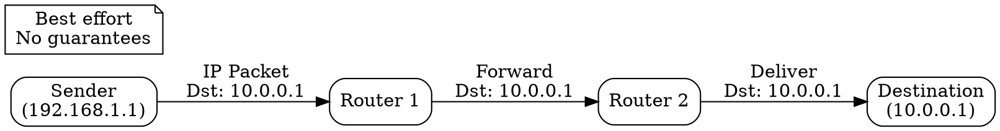

## The Problem
Devices on different networks need to address and route packets across multiple hops. Link-layer protocols only work within a single network, so a network-layer protocol is needed for internetwork communication.

## Core Idea
The fundamental network-layer protocol that provides logical addressing (IP addresses) and routing packets across networks from source to destination.

## How It Works
1. Assigns logical IP addresses to devices (IPv4: 32-bit, IPv6: 128-bit)
2. Each packet contains source and destination IP addresses
3. Routers examine destination IP and forward packets toward destination
4. Connectionless and unreliable: best-effort delivery without guarantees
5. TTL (Time To Live) field prevents packets from looping forever

## Visual Explanation

## Key Properties
- Connectionless: each packet routed independently
- Unreliable: no delivery guarantees, no error recovery
- Provides logical addressing and routing
- Foundation of the internet protocol suite

## Connections
- Built from: [[connectionless-service|Connectionless Service]] — IP is connectionless
- Builds into: [[tcp|TCP]] — runs on top of IP
- Builds into: [[udp|UDP]] — runs on top of IP
- Related: [[routing|Routing]] — how routers forward IP packets
- Related: [[ipv4|IPv4]] and [[ipv6|IPv6]] — protocol versions

## Edge Cases & Gotchas
- Fragmentation can occur when packet exceeds MTU (Maximum Transmission Unit)
- NAT (Network Address Translation) complicates end-to-end addressing
- IPv4 address exhaustion led to IPv6 development

## Sources
- [[cn-summary|Computer Networks Gemini Conversation]]
