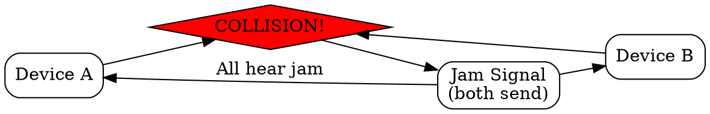

## The Problem
When a collision is detected in CSMA/CD, other devices on the network may not know a collision occurred and might start transmitting, causing more collisions. A way to quickly notify everyone is needed.

## Core Idea
A special signal sent immediately after a collision is detected, ensuring all devices on the network become aware of the collision and stop transmitting.

## How It Works
1. Device detects collision (signal strength change on wire)
2. Device immediately stops transmitting its data
3. Device sends a jam signal (a predetermined pattern of high-amplitude signal)
4. All devices hearing the jam signal know a collision occurred
5. Devices enter backoff algorithm to wait before retrying

## Visual Explanation

## Key Properties
- Short, high-intensity signal designed to be detected by all devices
- Sent by all devices that detected the collision
- Duration is at least the slot time (time to detect collision)
- Part of CSMA/CD protocol

## Connections
- Built from: [[csma-cd|CSMA/CD]] — jam signal is part of this protocol
- Related: [[collision-detection|Collision Detection]] — triggers jam signal
- Related: [[binary-exponential-backoff|Binary Exponential Backoff]] — follows jam signal
- Related: [[collision|Collision]] — what triggers the jam

## Edge Cases & Gotchas
- Jam signal itself could theoretically collide (rare, handled by backoff)
- Only works on wired shared media (not in switched/full-duplex networks)
- Slot time determines minimum jam signal duration

## Sources
- [[cn-summary|Computer Networks Gemini Conversation]]
