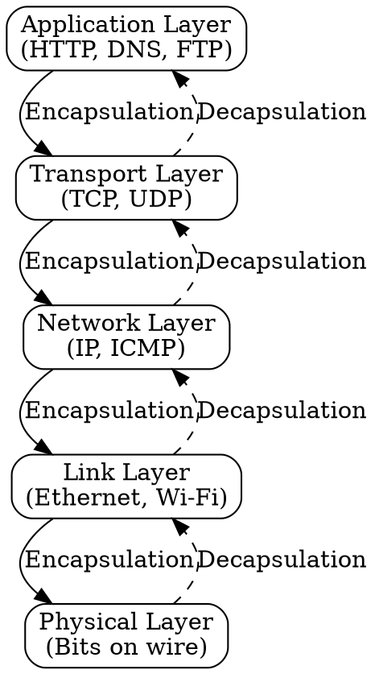
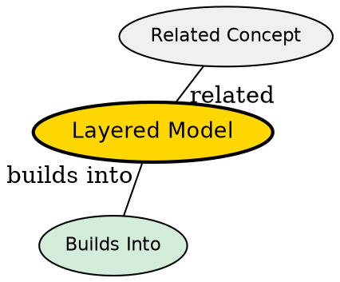

## The Problem
Networking is complex with many functions (addressing, routing, reliability, applications). Without organization, protocols would be monolithic and impossible to modify independently.

## Core Idea
A conceptual framework that divides network functionality into layers, where each layer provides services to the layer above and uses services from the layer below.

## How It Works
1. Each layer has a specific responsibility (e.g., physical, link, network, transport, application)
2. Data is encapsulated with headers as it moves down layers
3. Data is decapsulated as it moves up layers
4. Peer entities at the same layer communicate using protocols
5. Adjacent layers interact through service interfaces (SAPs)

## Visual Explanation

## Key Properties
- Modular: each layer can be modified independently
- Encapsulation: each layer adds its header
- Service abstraction: upper layers don't need to know lower layer details
- Two main models: OSI (7 layers) and TCP/IP (4-5 layers)

## Semantic Network

## Connections
- Built from: [[encapsulation|Encapsulation]] -- wrapping data with headers
- Built from: [[service|Service]] -- what each layer provides
- Built from: [[protocol|Protocol]] -- how peers communicate at each layer
- Related: [[tcp-ip-model|TCP/IP Model]] -- practical 4-layer model
- Related: [[osi-model|OSI Model]] -- conceptual 7-layer model

## Edge Cases & Gotchas
- Strict layering can reduce efficiency (extra headers, processing)
- Some modern protocols blur layer boundaries (e.g., MPLS)
- TCP/IP model is descriptive (how internet works), OSI is prescriptive (how it should work)