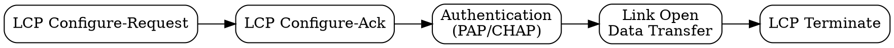
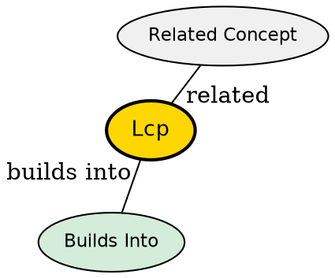

## The Problem
Before exchanging network data over a point-to-point link, the link must be established, configured, and tested. A protocol is needed to negotiate link parameters and manage the connection lifecycle.

## Core Idea
A protocol within the PPP suite responsible for establishing, configuring, testing, and terminating the data link connection.

## How It Works
1. **Link Establishment**: Exchange LCP packets to open the connection
2. **Parameter Negotiation**: Negotiate options like MRU (Maximum Receive Unit), authentication method
3. **Authentication**: Optionally run PAP or CHAP to verify user identity
4. **Link Maintenance**: Monitor link quality, handle echo requests/replies
5. **Link Termination**: Gracefully close the connection with LCP terminate packets

## Visual Explanation

## Key Properties
- Part of PPP protocol suite
- Negotiates link parameters before network-layer setup
- Provides echo mechanism for link testing
- Handles authentication phase

## Semantic Network

## Connections
- Built from: [[ppp-protocol|PPP Protocol]] -- LCP is a component of PPP
- Related: [[ncp|NCP]] -- follows LCP for network-layer configuration
- Related: [[authentication|Authentication]] -- PAP and CHAP integrated
- Related: [[mru|MRU]] -- Maximum Receive Unit negotiated by LCP

## Edge Cases & Gotchas
- Negotiation failure: if peers can't agree on parameters, link isn't established
- Authentication failure terminates the connection
- LCP is layered on top of the bare serial link (no framing -- PPP provides framing)