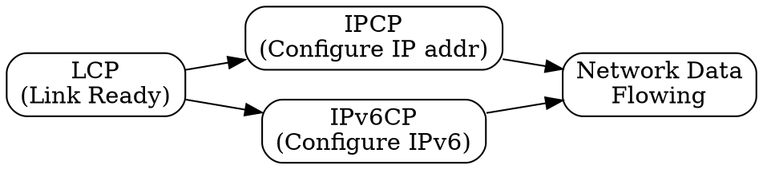

## The Problem
After the data link is established by LCP, network-layer protocols (like IP) need to be configured. Each network protocol has different configuration requirements (e.g., IP needs IP addresses).

## Core Idea
A family of protocols within the PPP suite that configure network-layer protocols to run over the established PPP link.

## How It Works
1. LCP establishes the data link first
2. Appropriate NCP is invoked for each network-layer protocol
3. IPCP (IP Control Protocol) negotiates IP addresses, DNS servers, etc.
4. Multiple NCPs can run simultaneously for different network protocols
5. NCP terminates when the link goes down

## Visual Explanation

## Key Properties
- One NCP per network-layer protocol (IPCP, IPv6CP, IPXCP, etc.)
- Configures protocol-specific parameters
- Runs after LCP succeeds
- Enables multiprotocol support over single link

## Connections
- Built from: [[ppp-protocol|PPP Protocol]] — NCP is a component of PPP
- Related: [[lcp|LCP]] — establishes link before NCP runs
- Related: [[ipcp|IPCP]] — most common NCP for IP
- Related: [[multiprotocol|Multiprotocol Support]] — NCP enables this

## Edge Cases & Gotchas
- If NCP fails, network-layer communication doesn't work even though link is up
- IPCP assigns IP addresses dynamically (like DHCP but within PPP)
- NCP can be terminated independently of LCP (e.g., renegotiate IP address)

## Sources
- [[cn-summary|Computer Networks Gemini Conversation]]
