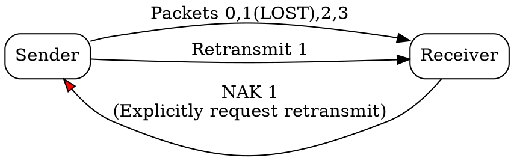

## The Problem
In some protocols, the receiver knows a packet is missing before the sender's timeout expires. A way to proactively tell the sender "I'm missing packet X" can speed up recovery.

## Core Idea
A control message sent by the receiver to the sender indicating that a packet was lost or corrupted and needs to be retransmitted.

## How It Works
1. Receiver detects missing packet (gap in sequence numbers)
2. Receiver sends NAK for the missing packet sequence number
3. Sender receives NAK and retransmits the missing packet immediately
4. Avoids waiting for timeout to detect loss
5. Used by Selective Repeat and some error correction protocols

## Visual Explanation

## Key Properties
- Explicitly signals packet loss (vs waiting for timeout)
- Speeds up retransmission compared to timeout-based recovery
- Used with Selective Repeat (not Go-Back-N which uses cumulative ACK)
- Can be combined with ACKs

## Connections
- Contrasts with: [[acknowledgment|Acknowledgment]] — positive vs negative feedback
- Built from: [[selective-repeat|Selective Repeat ARQ]] — uses NAKs
- Related: [[retransmission|Retransmission]] — NAK triggers this
- Related: [[timeout|Timeout]] — NAK avoids needing timeout for loss detection

## Edge Cases & Gotchas
- NAK loss can still require timeout-based recovery as backup
- Some protocols (TCP) don't use explicit NAKs — use duplicate ACKs instead to signal loss
- NAK storms: if many packets lost, many NAKs can add to congestion