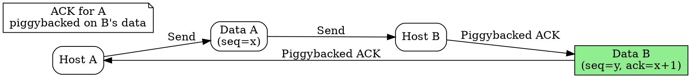

## The Problem
In full-duplex communication, sending separate ACK packets for received data wastes bandwidth. Each small ACK adds to network traffic and processing overhead.

## Core Idea
A technique where acknowledgments are attached to outgoing data packets instead of being sent as separate control packets, reducing overhead.

## How It Works
1. Host receives a data packet and needs to send an ACK
2. Instead of sending a separate ACK immediately, it waits briefly
3. If the host has its own data to send, it includes the ACK in the outgoing data packet's header
4. If no data is ready before a timer expires, a separate ACK is sent
5. TCP uses piggybacking extensively — the ACK field is always present in TCP headers

## Visual Explanation

## Key Properties
- Reduces number of packets on the network
- Uses a timer to avoid delaying ACKs indefinitely
- Requires full-duplex communication
- More complex implementation than separate ACKs

## Connections
- Built from: [[acknowledgment|Acknowledgment]] — what gets piggybacked
- Built from: [[sliding-window-protocol|Sliding Window Protocol]] — works with windowed protocols
- Related: [[tcp|TCP]] — uses piggybacking in every segment
- Related: [[full-duplex|Full-Duplex Communication]] — prerequisite for piggybacking

## Edge Cases & Gotchas
- Piggyback timer too long can cause unnecessary retransmissions (sender times out)
- Piggyback timer too short reduces effectiveness (separate ACK sent anyway)
- In asymmetric traffic (one side mostly receiving), piggybacking is less effective

## Sources
- [[cn-summary|Computer Networks Gemini Conversation]]
