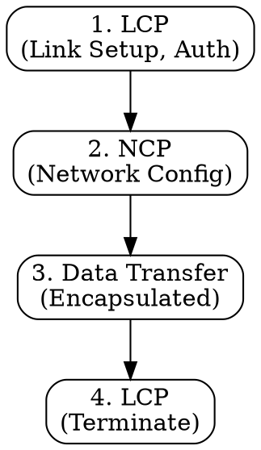

## The Problem
Direct serial connections between two nodes (like dial-up modems) need a protocol that can establish the link, authenticate users, and carry multiple network-layer protocols.

## Core Idea
A data link layer protocol suite for direct connections between two nodes, providing link establishment, authentication, and multiprotocol support.

## How It Works
1. **LCP (Link Control Protocol)**: Establishes, configures, and tests the link; negotiates options like MRU and authentication method
2. **Authentication**: Optional PAP or CHAP to verify user identity
3. **NCP (Network Control Protocol)**: Configures network-layer protocols (e.g., IPCP for IP addresses)
4. **Data Encapsulation**: Frames data with header (flag, address, control) and trailer (FCS for error detection)
5. **Termination**: Gracefully closes the connection when done

## Visual Explanation

## Key Properties
- Works over serial links (dial-up, serial cables)
- Supports authentication (PAP, CHAP)
- Multiprotocol: can carry IP, IPv6, IPX via different NCPs
- Includes error detection (FCS) but not correction

## Connections
- Built from: [[data-link-layer|Data Link Layer]] — operates at this layer
- Built from: [[lcp|LCP]] — link control component
- Built from: [[ncp|NCP]] — network control component
- Related: [[pppoe|PPPoE]] — PPP over Ethernet
- Related: [[authentication|Authentication]] — PAP and CHAP mechanisms

## Edge Cases & Gotchas
- Mostly replaced by PPPoE for modern broadband (DSL, fiber)
- No error correction — only detection via FCS
- MRU negotiation can fail if peers disagree on maximum size