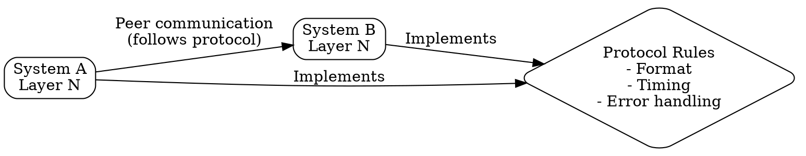

## The Problem
Devices from different manufacturers need to communicate, but they have different hardware, software, and data formats. Without agreed-upon rules, devices cannot understand each other's messages.

## Core Idea
A set of rules, formats, and procedures that define how devices communicate — specifying message formats, timing, sequencing, and error handling.

## How It Works
1. Defines message formats (headers, payload structure)
2. Specifies message semantics (what each field means)
3. Establishes rules for when messages are sent and how to respond
4. Includes error detection and handling procedures
5. Operates between peer entities at the same layer across different systems

## Visual Explanation

## Key Properties
- Horizontal relationship: governs peer-to-peer communication across systems
- Defines the "how" of communication at a layer
- Enables interoperability between different implementations
- Part of a protocol suite (e.g., TCP/IP suite)

## Connections
- Contrasts with: [[service|Service]] — protocol is "how", service is "what"
- Built from: [[layered-model|Layered Model]] — protocols exist at each layer
- Related: [[tcp|TCP]] — transport layer protocol example
- Related: [[ip-protocol|IP Protocol]] — network layer protocol example
- Related: [[protocol-suite|Protocol Suite]] — collection of related protocols

## Edge Cases & Gotchas
- Protocol specification vs implementation: specs can be ambiguous leading to interop issues
- Protocol ossification: widely deployed protocols become hard to change (e.g., TCP)
- Versioning: protocols need backward compatibility as they evolve

## Sources
- [[cn-summary|Computer Networks Gemini Conversation]]
