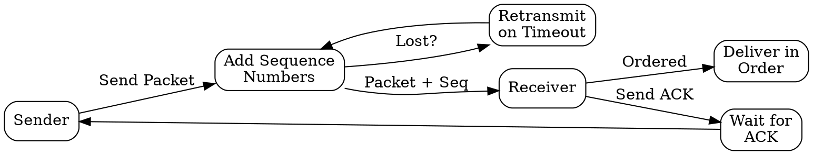

# Reliable Data Transfer

## The Problem
Networks are inherently unreliable — packets get lost, corrupted, duplicated, or arrive out of order. Applications like file transfer and email need guarantees that data arrives correctly and completely.

## Core Idea
A set of mechanisms ensuring data is delivered completely, in order, without errors, despite network unreliability.

## How It Works
1. Sequence numbers track packet order and detect missing packets
2. Acknowledgments (ACKs) confirm successful receipt
3. Retransmission of lost or corrupted packets after timeout
4. Error detection via checksums or CRC
5. Flow control prevents overwhelming the receiver
6. Ordered delivery through receiver buffering and reordering

## Visual Explanation

## Key Properties
- Guaranteed delivery through retransmission
- Preserves packet ordering
- Detects and recovers from packet loss, corruption, duplication
- Requires state maintenance (sequence numbers, timers, buffers)

## Connections
- Built from: [[sequence-numbers|Sequence Numbers]] — enables ordering and loss detection
- Built from: [[acknowledgment|Acknowledgment]] — confirms delivery
- Builds into: [[tcp|TCP]] — implements reliable data transfer
- Builds into: [[connection-oriented-service|Connection-Oriented Service]] — core feature
- Contrasts with: [[best-effort-delivery|Best Effort Delivery]] — no guarantees

## Edge Cases & Gotchas
- Ack loss can cause unnecessary retransmission (handled by duplicate detection)
- Retransmission timeout tuning is critical — too short causes unnecessary retrans, too long adds latency
- Duplicate packets must be detected and discarded

## Sources
- [[cn-summary|Computer Networks Gemini Conversation]]
