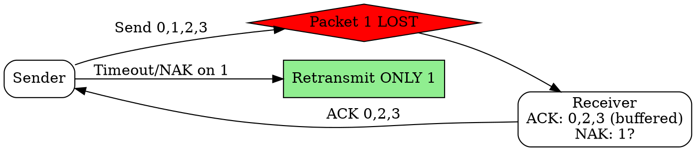

## The Problem
Go-Back-N wastes bandwidth by retransmitting packets that arrived correctly. A more efficient approach is needed to only retransmit truly lost packets.

## Core Idea
A sliding window protocol where only lost or corrupted packets are retransmitted, while correctly received out-of-order packets are buffered at the receiver.

## How It Works
1. Sender maintains a window of unacknowledged packets
2. Receiver accepts and buffers out-of-order packets
3. Receiver sends individual ACK for each correctly received packet
4. If a packet is lost, sender retransmits only that packet (not all subsequent ones)
5. Receiver reorders buffered packets once missing packets arrive

## Visual Explanation

## Key Properties
- More efficient: only retransmits lost packets
- More complex receiver: must buffer out-of-order packets
- Individual ACKs (not cumulative)
- Higher memory requirement at receiver for buffering

## Connections
- Built from: [[sliding-window-protocol|Sliding Window Protocol]] — based on sliding window
- Contrasts with: [[go-back-n|Go-Back-N ARQ]] — selective vs full retransmission
- Related: [[negative-acknowledgment|Negative Acknowledgment]] — NAK used to signal missing packets
- Related: [[receiver-buffer|Receiver Buffer]] — needed for out-of-order packets

## Edge Cases & Gotchas
- Window size must be <= sequence number space/2 to avoid ambiguity
- More complex state management at receiver
- NAK generation and handling adds complexity