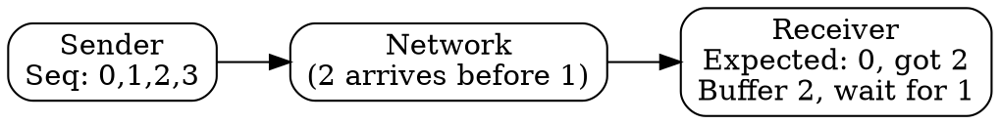

## The Problem
Packets can arrive out of order, be duplicated, or get lost in the network. The receiver needs a way to detect these issues and reconstruct the original data order.

## Core Idea
Unique, consecutive numbers assigned to each packet (or byte in TCP) that allow the receiver to detect missing packets, reorder out-of-sequence packets, and identify duplicates.

## How It Works
1. Sender assigns incrementing sequence numbers to outgoing packets/bytes
2. Receiver tracks expected sequence number
3. If received sequence > expected: packets are missing (gap detected)
4. If received sequence < expected: duplicate packet (discard)
5. Receiver can buffer out-of-order packets and reorder when gaps are filled

## Visual Explanation

## Key Properties
- Enables ordered delivery despite out-of-order arrival
- Detects lost packets (gap in sequence)
- Detects duplicate packets (seq already seen)
- In TCP, sequence numbers are per-byte, not per-packet

## Connections
- Built from: [[reliable-data-transfer|Reliable Data Transfer]] — enables reliability
- Built from: [[sliding-window-protocol|Sliding Window Protocol]] — window tracks sequence numbers
- Related: [[acknowledgment|Acknowledgment]] — ACKs reference sequence numbers
- Related: [[tcp|TCP]] — uses byte-level sequence numbers

## Edge Cases & Gotchas
- Sequence number space is finite (wraps around) — must be large enough to avoid ambiguity
- Initial sequence numbers are randomly chosen to avoid confusion with old connections
- TCP sequence numbers increment by bytes, not segments

## Sources
- [[cn-summary|Computer Networks Gemini Conversation]]
