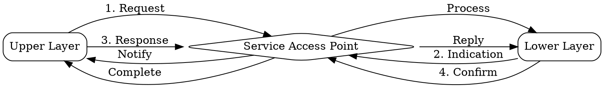

# Service Primitives

## The Problem
Layers need a standardized way to communicate across the service interface. Without defined operations, each implementation would have ad-hoc interfaces making layers non-interchangeable.

## Core Idea
The set of operations or function calls available at a Service Access Point (SAP) for requesting services, receiving indications, and confirming operations.

## How It Works
1. **Request**: Upper layer asks lower layer to perform an action (e.g., send data)
2. **Indication**: Lower layer notifies upper layer of an event (e.g., data received)
3. **Response**: Upper layer replies to an indication from lower layer
4. **Confirm**: Lower layer acknowledges completion of a requested action

## Visual Explanation

## Key Properties
- Four basic types: Request, Indication, Response, Confirm
- Implemented as API calls in real systems (e.g., socket API)
- Define the contract between adjacent layers
- Enable standardized layer interaction

## Connections
- Built from: [[service-access-point|Service Access Point]] — where primitives are invoked
- Built from: [[service|Service]] — the operations that implement the service
- Related: [[socket-api|Socket API]] — concrete implementation of primitives
- Related: [[layered-model|Layered Model]] — primitives operate between layers

## Edge Cases & Gotchas
- Not all primitives are used for every service (connectionless may not need confirm)
- Primitive ordering matters — must follow the request-indication-response-confirm pattern
- Some implementations combine primitives (e.g., synchronous calls that block until confirm)

## Sources
- [[cn-summary|Computer Networks Gemini Conversation]]
