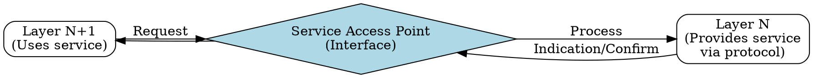
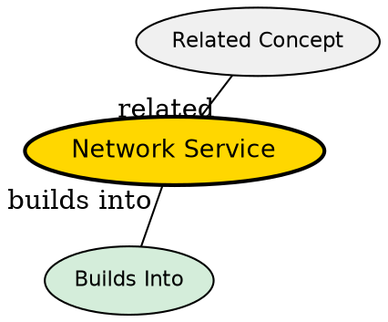

## The Problem
Layers in a network architecture need to provide capabilities to the layer above without exposing implementation details. The upper layer needs to know what functionality is available, not how it's implemented.

## Core Idea
An abstract description of the capabilities or operations that a lower layer provides to the layer directly above it -- the "what" of what a layer offers.

## How It Works
1. Lower layer defines a service interface (Service Access Point)
2. Upper layer makes requests through the interface (service primitives)
3. Lower layer performs the requested operation, possibly using its protocol
4. Lower layer returns responses or indications through the interface
5. The upper layer doesn't need to know protocol details -- just the service contract

## Visual Explanation

## Key Properties
- Vertical relationship: between adjacent layers on the same system
- Abstract: describes "what" not "how"
- Accessed through service primitives (request, indication, response, confirm)
- Implemented by protocols at the same layer across systems

## Semantic Network

## Connections
- Contrasts with: [[protocol|Protocol]] -- service is "what", protocol is "how"
- Built from: [[service-access-point|Service Access Point]] -- the interface point
- Built from: [[service-primitives|Service Primitives]] -- the operations available
- Related: [[layered-model|Layered Model]] -- services exist between layers
- Related: [[connection-oriented-service|Connection-Oriented Service]] -- example of a service

## Edge Cases & Gotchas
- Service primitives are often implemented as API calls (e.g., socket API)
- Service changes require updating all upper layers that use it
- A single service can have multiple protocol implementations