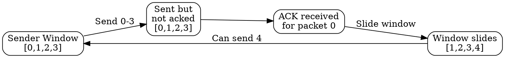

## The Problem
Stop-and-wait protocols waste bandwidth by waiting for an ACK after each packet. On high-latency links, the sender is idle most of the time, severely under-utilizing available bandwidth.

## Core Idea
A protocol that allows a sender to transmit multiple packets before receiving acknowledgments, using sequence numbers and a "window" that slides forward as ACKs are received.

## How It Works
1. Sender assigns sequence numbers to packets (or bytes in TCP)
2. Sender maintains a window of sequence numbers it's allowed to send
3. Packets within the window can be sent without waiting for ACKs
4. As ACKs arrive, the window "slides" forward, allowing new packets to be sent
5. Window size limits how many unacknowledged packets can be in transit

## Visual Explanation

## Key Properties
- Improves channel utilization over stop-and-wait
- Provides flow control (window size limits in-flight data)
- Enables reliable delivery with sequence numbers
- Used by TCP and many data link protocols

## Connections
- Built from: [[sequence-numbers|Sequence Numbers]] — identifies packets in window
- Built from: [[acknowledgment|Acknowledgment]] — slides window forward
- Builds into: [[tcp|TCP]] — uses sliding window for flow/congestion control
- Related: [[flow-control|Flow Control]] — window size enforces flow control
- Contrasts with: [[stop-and-wait|Stop-and-Wait]] — one packet vs multiple

## Edge Cases & Gotchas
- Window size must be less than sequence number space to avoid ambiguity
- Selective vs Go-Back-N: different strategies for handling lost packets
- Zero window: receiver can advertise window=0 to stop sender completely

## Sources
- [[cn-summary|Computer Networks Gemini Conversation]]
