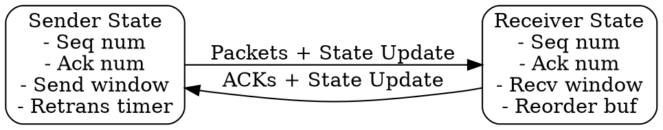

# Stateful Protocol

## The Problem
Some network services need to track ongoing communication state (sequence numbers, buffers, connection status) across multiple packets. Stateless protocols can't provide reliable, ordered delivery or flow control.

## Core Idea
A protocol where endpoints maintain persistent information about the connection or session across multiple packet exchanges.

## How It Works
1. Both sender and receiver store state variables (sequence numbers, acknowledgment numbers, window sizes, buffers)
2. State is established during connection setup
3. State is updated with each packet exchange
4. State is destroyed during connection teardown
5. State enables features like reliable delivery, ordering, and flow control

## Visual Explanation

## Key Properties
- Maintains connection context across packet exchanges
- Enables reliable, ordered delivery and flow control
- Consumes memory resources for state storage
- State must be recovered or reset after failures

## Connections
- Built from: [[connection-oriented-service|Connection-Oriented Service]] — inherently stateful
- Contrasts with: [[stateless-protocol|Stateless Protocol]] — no persistent state
- Related: [[tcp|TCP]] — stateful transport protocol
- Related: [[session|Session]] — another form of protocol state

## Edge Cases & Gotchas
- Server memory exhaustion from too many concurrent connections (DoS risk)
- State loss during crash requires connection reset
- State synchronization in load-balanced environments is challenging

## Sources
- [[cn-summary|Computer Networks Gemini Conversation]]
