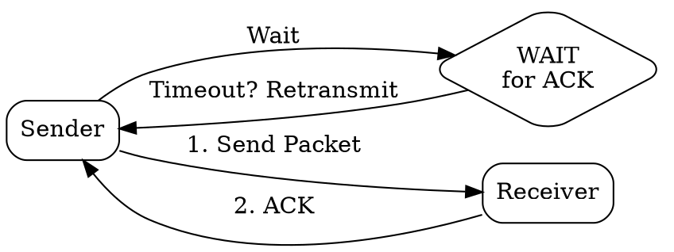
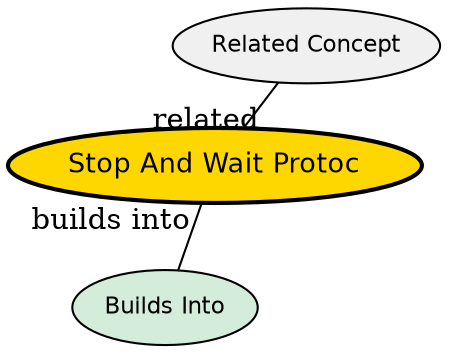

## The Problem
How do you ensure reliable delivery with minimal complexity? A simple approach is needed for reliable transmission without the complexity of sliding windows.

## Core Idea
A simple reliable protocol where the sender transmits one packet, then stops and waits for an acknowledgment before sending the next packet.

## How It Works
1. Sender transmits a single packet
2. Sender stops and waits for an ACK from receiver
3. Receiver sends ACK after receiving packet correctly
4. Sender receives ACK, then sends next packet
5. If timeout occurs before ACK, sender retransmits the packet

## Visual Explanation

## Key Properties
- Simple to implement
- Lowest possible efficiency on high-latency links
- Wastes bandwidth -- sender idle while waiting for ACK
- Suitable for low-latency or low-throughput scenarios

## Semantic Network

## Connections
- Contrasts with: [[sliding-window-protocol|Sliding Window Protocol]] -- one packet vs multiple
- Built from: [[acknowledgment|Acknowledgment]] -- core mechanism
- Related: [[reliable-data-transfer|Reliable Data Transfer]] -- simple form of reliable delivery
- Related: [[transmission-error-detection|Transmission Error Detection]] -- detects corrupted packets

## Edge Cases & Gotchas
- Very inefficient on long-RTT links (satellite: RTT is seconds, sender idle most of time)
- Duplicate packets possible if ACK is lost (handled by sequence numbers)
- Utilization = (packet transmission time) / (RTT + transmission time) -- very low for high RTT