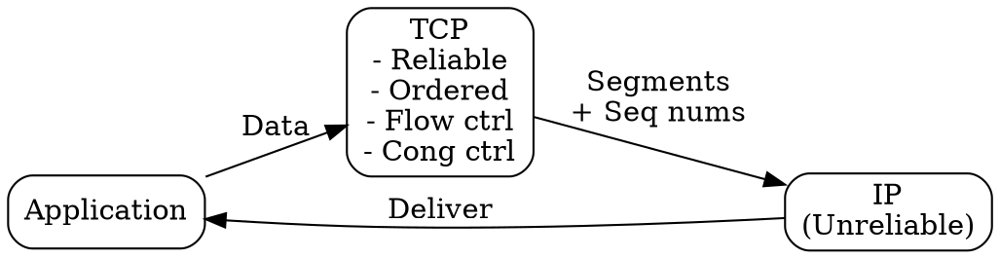

# TCP

## The Problem
Applications need reliable, ordered, connection-oriented data delivery between hosts. The underlying IP protocol is connectionless and unreliable, so a transport protocol is needed to provide these guarantees.

## Core Idea
A connection-oriented, reliable transport protocol that provides ordered, error-checked, flow-controlled, and congestion-controlled byte-stream delivery between applications.

## How It Works
1. Establishes connection via three-way handshake (SYN, SYN-ACK, ACK)
2. Breaks data into segments with sequence numbers
3. Provides reliable delivery via acknowledgments and retransmission
4. Implements flow control via receive window (advertised by receiver)
5. Implements congestion control via congestion window (adjusted by sender)
6. Terminates connection with FIN/ACK exchange

## Visual Explanation

## Key Properties
- Connection-oriented: requires setup and teardown
- Reliable: guarantees delivery, order, error-checking
- Stateful: maintains connection state at both endpoints
- Full-duplex: bidirectional data flow
- Used by HTTP, HTTPS, FTP, SMTP, SSH

## Connections
- Built from: [[connection-oriented-service|Connection-Oriented Service]] — implements this service
- Built from: [[three-way-handshake|Three-Way Handshake]] — connection setup
- Built from: [[sliding-window-protocol|Sliding Window Protocol]] — flow/congestion control
- Built from: [[ip-protocol|IP Protocol]] — runs on top of IP
- Related: [[udp|UDP]] — unreliable alternative transport protocol
- Related: [[flow-control|Flow Control]] and [[congestion-control|Congestion Control]]

## Edge Cases & Gotchas
- Head-of-line blocking: lost packet delays all subsequent packets even if received
- SYN flood attacks exploit connection setup state
- TCP meltdown: aggressive retransmission in poor networks can worsen congestion

## Sources
- [[cn-summary|Computer Networks Gemini Conversation]]
