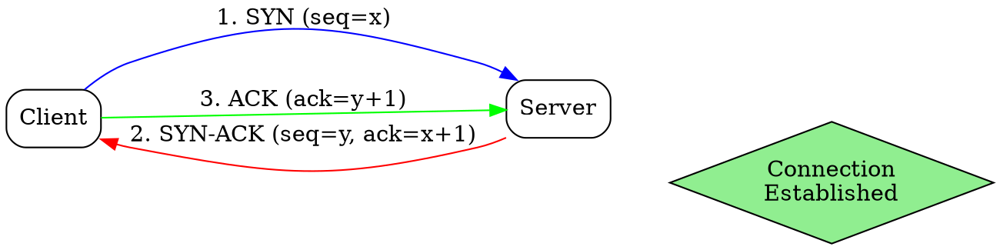

# Three-Way Handshake

## The Problem
Before exchanging data, two endpoints need to agree on connection parameters and establish synchronization. Without a handshake, both sides wouldn't know if the other is ready or what sequence numbers to expect.

## Core Idea
A three-message exchange (SYN, SYN-ACK, ACK) that establishes a TCP connection by synchronizing sequence numbers and confirming both sides are ready.

## How It Works
1. Client sends SYN packet with initial sequence number to server
2. Server responds with SYN-ACK packet containing its own sequence number and acknowledging client's SYN
3. Client sends ACK packet acknowledging server's SYN-ACK
4. Connection is now established and data transfer can begin

## Visual Explanation

## Key Properties
- Synchronizes sequence numbers in both directions
- Confirms both client and server are reachable
- Negotiates connection parameters
- Prevents old duplicate connection initiations from causing confusion

## Connections
- Built from: [[tcp|TCP]] — the protocol that uses this handshake
- Builds into: [[connection-oriented-service|Connection-Oriented Service]] — enables reliable connections
- Related: [[sequence-numbers|Sequence Numbers]] — synchronized during handshake
- Related: [[acknowledgment|Acknowledgment]] — used in SYN-ACK and ACK

## Edge Cases & Gotchas
- SYN flood attacks can exhaust server resources with half-open connections
- Retransmission of SYN occurs if timeout expires without SYN-ACK
- Simultaneous open (both sides send SYN first) is handled by TCP as a special case

## Sources
- [[cn-summary|Computer Networks Gemini Conversation]]
