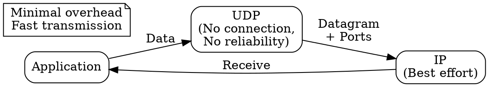

## The Problem
Some applications (DNS, VoIP, gaming) need fast, low-latency communication where occasional packet loss is acceptable. TCP's reliability mechanisms add unacceptable delay and overhead for these use cases.

## Core Idea
A connectionless, unreliable transport protocol that sends independent datagrams with minimal overhead, trading reliability for speed.

## How It Works
1. No connection establishment — applications send datagrams immediately
2. Each UDP segment has source port, destination port, length, and checksum
3. No guarantees: packets can be lost, duplicated, or arrive out of order
4. No flow control or congestion control
5. Applications must handle reliability at the application layer if needed

## Visual Explanation

## Key Properties
- Connectionless: no handshake or state
- Unreliable: best-effort delivery only
- Lightweight: 8-byte header vs TCP's 20+ bytes
- Supports broadcast and multicast (unlike TCP)

## Connections
- Built from: [[connectionless-service|Connectionless Service]] — implements this service
- Built from: [[ip-protocol|IP Protocol]] — runs on top of IP
- Contrasts with: [[tcp|TCP]] — unreliable vs reliable transport
- Related: [[dns|DNS]] — uses UDP for fast lookups
- Related: [[voip|VoIP]] — uses UDP for real-time communication

## Edge Cases & Gotchas
- Checksum is optional in IPv4 (unlike TCP which always has it)
- No backpressure — sender can overwhelm receiver
- Fragmentation happens at IP layer, not UDP layer