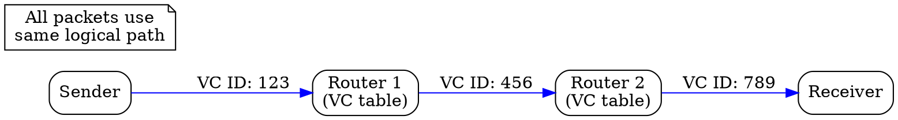

# Virtual Circuit

## The Problem
Circuit switching reserves physical resources but is inefficient. Packet switching is efficient but packets may take different paths. Some services need the benefits of both: a logical "dedicated path" without reserving physical resources.

## Core Idea
A logical connection where packets follow the same path through the network using pre-established routing state, without dedicating physical transmission resources.

## How It Works
1. Connection establishment sets up routing state at each intermediate switch/router
2. All packets in the flow follow the same path using the virtual circuit identifier
3. No need for full destination address in each packet — just the VC ID
4. Resources are allocated logically, not physically
5. Connection teardown releases the VC state

## Visual Explanation

## Key Properties
- Logical path maintained for connection duration
- Packets share same route without per-packet routing decisions
- VC identifiers are local to each link (swapped at each hop)
- Contrasts with datagram: no per-packet routing vs per-packet routing

## Connections
- Built from: [[connection-oriented-service|Connection-Oriented Service]] — uses virtual circuits
- Built from: [[circuit-switching|Circuit Switching]] — inspiration for VC concept
- Contrasts with: [[datagram|Datagram]] — independent per-packet routing
- Related: [[three-way-handshake|Three-Way Handshake]] — establishes VC state

## Edge Cases & Gotchas
- VC state at routers means router failures break all active VCs
- VC ID spaces are link-local, requiring translation at each hop
- Not used in modern IP networks (uses datagram approach instead)

## Sources
- [[cn-summary|Computer Networks Gemini Conversation]]
