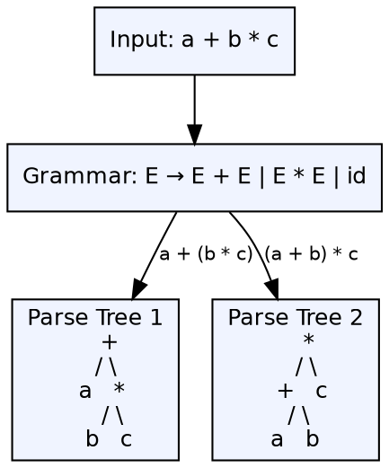

## The Problem

A grammar that allows more than one parse tree for the same input string means the compiler cannot determine the unique syntactic structure of the program. This leads to unpredictable behavior — different parsers may interpret the same program differently.

## Core Idea

A grammar is **ambiguous** if there exists a string in its language that has more than one leftmost derivation (equivalently, more than one parse tree). Ambiguity is a property of the grammar, not necessarily of the language — many ambiguous grammars can be rewritten as unambiguous ones.

## How It Works

Ambiguity arises when a non-terminal can be expanded in multiple ways that lead to the same input. Classic examples: **dangling else** (`if x if y ... else ...` — which if does else belong to?), and **expression associativity** (`E → E + E | id` allows two trees for `a + b + c`). The parser resolves ambiguity through precedence rules, associativity declarations, or grammar rewriting.

## Visual Explanation

## Key Properties

- **Definition:** More than one leftmost derivation for some string
- **Not always a language property:** The same language can have both ambiguous and unambiguous grammars
- **Dangling else:** Classic ambiguity in languages with nested if-then-else
- **Expression ambiguity:** Operator precedence and associativity are typically ambiguous in naive expression grammars
- **Parser resolution:** Yacc and Bison allow precedence and associativity declarations to resolve ambiguities

## Connections

- **Built from:** [[context-free-grammar|Context-Free Grammar]] — ambiguity is a property of CFGs
- **Contrasts with:** [[unambiguous-grammar|Unambiguous Grammar]] — a grammar producing exactly one parse tree per string
- **Related:** [[top-down-parsing|Top-Down Parsing]] — some ambiguous grammars cause non-determinism in LL parsers
- **Related:** [[operator-precedence-parser|Operator Precedence Parser]] — specifically designed to handle ambiguous expression grammars using precedence rules
- **Related:** [[syntax-analysis|Syntax Analysis]] — detecting and resolving ambiguity is a core concern in parsing

## Edge Cases & Gotchas

- **Inherent ambiguity:** Some languages are inherently ambiguous — every grammar for them is ambiguous
- **Ambiguity detection is undecidable:** There is no algorithm that can determine whether an arbitrary CFG is ambiguous
- **Yacc/Bison resolution:** By default, yacc resolves shift-reduce conflicts in favor of shift — this may not always be what the user wants
- **Disambiguating rules:** Associativity declarations (`%left`, `%right`) and precedence levels resolve ambiguity without grammar rewriting

## Sources

- [[compilerdesign-summary|Compiler Design Tutorial]] — covers ambiguous grammar as a key concept in syntax analysis
- [[cd2-summary|Compiler Design for GATE Exam]] — covers ambiguous grammar and grammar classification
