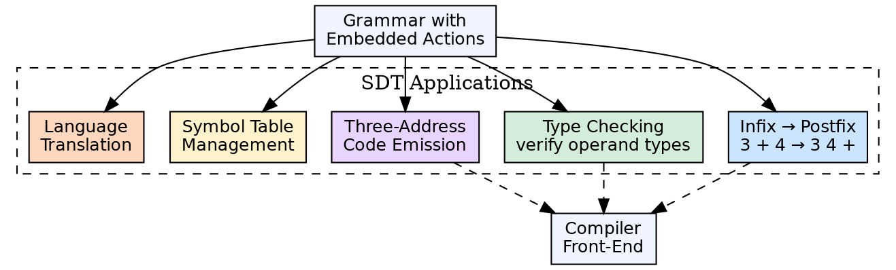
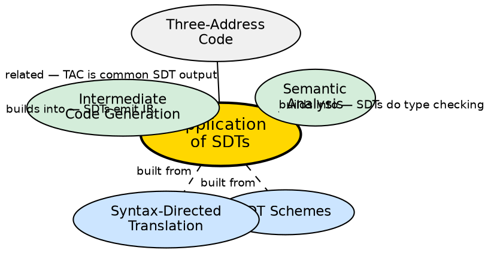

## The Problem

SDTs are a theoretical framework, but compilers need concrete translations: convert infix expressions to postfix, type-check assignments, emit three-address code, and set up symbol table entries. Each of these requires different semantic actions at different points in the grammar. Understanding SDT applications shows how the theory produces real compiler output.

## Core Idea

Syntax-directed translations have several practical applications in compilers: **infix-to-postfix conversion** (for expression evaluation), **type checking** (verifying operand types against operator requirements), **intermediate code generation** (emitting three-address code during parsing), **symbol table management** (entering declarations, looking up identifiers), and **grammar-based translation** (converting one language to another, like AST transformations).

## How It Works

For infix-to-postfix: each production `E → E + T` has action `{ print('+'); }` placed at the point where the operator is recognized. For type checking: `E → E₁ + T` has action `{ if (E₁.type != int || T.type != int) error(); E.type = int; }`. For code generation: `E → id := E₁` emits `gen(id.place, '=', E₁.place)`. Each application follows the same pattern: the action is attached to the production and executes when the parser reduces that production.

## Visual Explanation

## Semantic Network

## Key Properties

- **Infix to postfix:** Actions print operators when their operands are fully parsed — most common educational example
- **Type checking:** Actions verify type compatibility and propagate type information through the parse tree
- **Code emission:** SDTs emit three-address code instructions as actions during parsing
- **Symbol table:** Actions enter declarations and look up identifiers during parsing
- **Translation flexibility:** The same grammar can produce different outputs (code, types, errors) by changing the actions

## Connections

- **Built from:** [[sdt-schemes|SDT Schemes]] — translation schemes define how actions are embedded
- **Built from:** [[syntax-directed-translation|Syntax-Directed Translation]] — the theoretical foundation
- **Builds into:** [[intermediate-code-generation|Intermediate Code Generation]] — SDTs are the mechanism for emitting IR
- **Related:** [[three-address-code|Three-Address Code]] — common target of SDT-based code generation
- **Related:** [[semantic-analysis|Semantic Analysis]] — type checking SDTs are part of semantic analysis

## Edge Cases & Gotchas

- **Order dependency:** Action order matters — printing an operator before its operands gives prefix instead of postfix
- **Side effects:** Actions with side effects (like entering symbol table entries) must execute exactly once per construct
- **Error recovery:** When the parser recovers from an error, previously executed actions may have created incomplete symbol table entries
- **SDT vs separate pass:** The "action during parsing" model works for simple translation; complex optimizations need separate passes

## Sources

- [[cd2-summary|Compiler Design for GATE Exam]] — covers applications of syntax-directed translations
