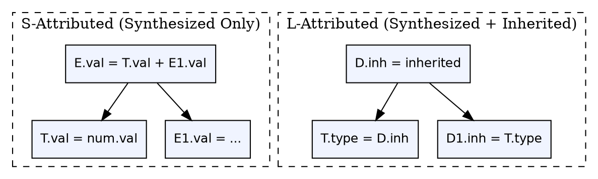

## The Problem

Semantic actions in syntax-directed translations need to pass information around the parse tree. Some information flows upward (a subexpression's computed type), and some flows downward (the expected type context). Without a formal model of attribute flow, the evaluation order becomes unpredictable.

## Core Idea

**S-attributed SDTs** use only **synthesized attributes** — values computed from children and passed upward to the parent. **L-attributed SDTs** allow both **synthesized** and **inherited attributes**, where inherited attributes flow from left-to-right and top-to-bottom. S-attributed SDTs can be evaluated bottom-up; L-attributed SDTs require top-down or left-to-right evaluation.

## How It Works

In an S-attributed SDT, every action computes a value for the left-hand side non-terminal using only values from right-hand side non-terminals. In an L-attributed SDT, inherited attributes of a right-hand side symbol can depend only on: inherited attributes of the left-hand side, synthesized attributes of symbols to its left, or its own synthesized attributes.

## Visual Explanation

## Key Properties

- **S-attributed:** Only synthesized attributes, bottom-up evaluation, works with any parser
- **L-attributed:** Synthesized + inherited attributes, left-to-right evaluation, works with top-down parsers
- **Synthesized attributes:** Flow upward (child → parent), computed from children
- **Inherited attributes:** Flow downward and left-to-right (parent → child, sibling → sibling)
- **Evaluation compatibility:** S-attributed SDTs pair with LR parsing; L-attributed SDTs pair with LL parsing

## Connections

- **Built from:** [[syntax-directed-translation|Syntax-Directed Translation]] — SDT classification by attribute type
- **Related:** [[top-down-parsing|Top-Down Parsing]] — L-attributed SDTs are naturally evaluated during top-down parsing
- **Related:** [[bottom-up-parsing|Bottom-Up Parsing]] — S-attributed SDTs are naturally evaluated during bottom-up parsing
- **Related:** [[syntax-analysis|Syntax Analysis]] — how attribute evaluation integrates with parsing strategies
- **Related:** [[semantic-analysis|Semantic Analysis]] — attributes carry type information needed for semantic checking

## Edge Cases & Gotchas

- **Circular dependencies:** Attribute dependency graphs must be acyclic — circular definitions are invalid
- **L-attributed ≠ all inherited:** Not all grammars with inherited attributes are L-attributed — the restriction on attribute dependencies is strict
- **Bottom-up evaluation of L-attributed:** Possible with explicit action placement in the grammar (annotation markers), but requires grammar transformation
- **Real compiler usage:** Most real compilers use a mix — type information from SDTs combined with separate semantic analysis passes

## Sources

- [[compilerdesign-summary|Compiler Design Tutorial]] — covers S-attributed and L-attributed SDTs
- [[cd2-summary|Compiler Design for GATE Exam]] — covers synthesized vs inherited attributes
