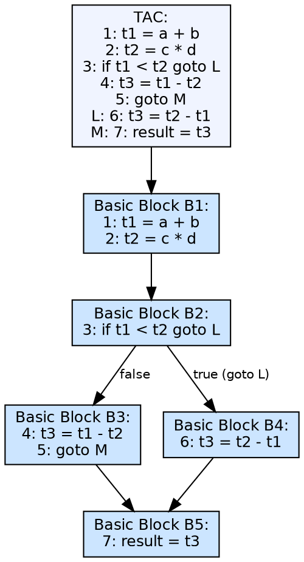
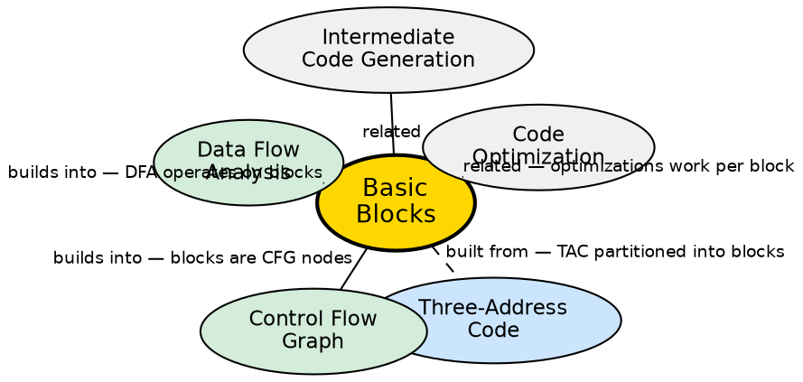

## The Problem

Three-address code is a flat sequence of instructions, but optimizations need to reason about program structure. A program has branches and joins — different paths of execution. Before analysis can begin, the compiler must partition TAC into straight-line segments where control enters at the top and leaves at the bottom, with no internal branches.

## Core Idea

A basic block is a sequence of consecutive three-address code instructions with a single entry point (the first instruction) and a single exit point (the last instruction). No jumps enter or leave the block except at the entry and exit. Within a basic block, if one instruction executes, all execute. Basic blocks form the nodes of the control-flow graph.

## How It Works

Basic blocks are identified by finding **leaders** — the first instruction of a block. Leaders are: the first instruction of the program, any instruction that is the target of a jump, and any instruction immediately following a jump. Starting from each leader, the block extends until another leader is reached (or the end). The block includes all instructions from the leader up to (but not including) the next leader.

## Visual Explanation

## Semantic Network

## Key Properties

- **Single entry, single exit:** Control enters at the top and leaves at the bottom
- **Leader-based identification:** Partition TAC by finding leaders (first instruction, jump targets, post-jump instructions)
- **Sequential execution:** If the first instruction executes, all instructions execute (no internal branches)
- **Optimization unit:** Many optimizations (constant propagation, dead code elimination) operate within a single basic block
- **CFG nodes:** Basic blocks are the vertices of the control-flow graph

## Connections

- **Built from:** [[three-address-code|Three-Address Code]] — TAC is partitioned into basic blocks
- **Builds into:** [[control-flow-graph|Control Flow Graph]] — basic blocks form the nodes of the CFG
- **Builds into:** [[data-flow-analysis|Data Flow Analysis]] — DFA uses GEN/KILL sets per basic block
- **Related:** [[code-optimization|Code Optimization]] — many local optimizations operate within a single block
- **Related:** [[intermediate-code-generation|Intermediate Code Generation]] — ICG produces the TAC that gets partitioned

## Edge Cases & Gotchas

- **Empty blocks:** A leader may be immediately followed by another leader, creating an empty basic block — rare but possible
- **Overlapping blocks:** Blocks cannot overlap — each instruction belongs to exactly one block
- **Critical edges:** Edges from a block with multiple successors to a block with multiple predecessors are called critical edges — they complicate optimization
- **Unreachable code:** Instructions after an unconditional jump (but before the next leader) are unreachable — dead code elimination can remove them

## Sources

- [[cd2-summary|Compiler Design for GATE Exam]] — covers basic blocks in intermediate code generation
