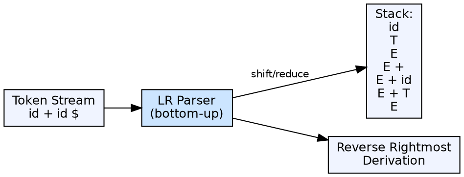

## The Problem

Top-down parsers can only handle a restricted class of grammars (LL grammars). Many common programming language constructs — especially operator precedence, left recursion, and certain ambiguous patterns — are not LL-parseable. A more powerful parsing strategy is needed.

## Core Idea

Bottom-up parsing builds the parse tree from the leaves (tokens) upward to the root (start symbol). It reads tokens left-to-right and uses a stack to recognize production right-hand sides (handles). When a handle appears on top of the stack, the parser **reduces** it to the corresponding non-terminal. LR parsers are the most common bottom-up family.

## How It Works

The parser has two operations: **shift** (push the current token onto the stack) and **reduce** (pop the top symbols matching a production's RHS, push the LHS non-terminal). It uses a parsing table with ACTION and GOTO entries. The ACTION table specifies shift/reduce/accept based on state and current token. The GOTO table specifies the next state after a reduction.

## Visual Explanation

## Key Properties

- **Direction of tree building:** Leaves → root (bottom-up)
- **Derivation type:** Reverse of rightmost derivation
- **Operations:** Shift (push token) and Reduce (apply production)
- **LR family:** SLR, CLR (LR(1)), LALR — increasing power and complexity
- **Handle:** The right-hand side of a production that is ready to be reduced

## Connections

- **Built from:** [[parser-introduction|Parser Introduction]] — bottom-up is a category of parsing
- **Built from:** [[shift-reduce-parser|Shift Reduce Parser]] — bottom-up parsers use shift-reduce as their fundamental mechanism
- **Contrasts with:** [[top-down-parsing|Top-Down Parsing]] — bottom-up reduces; top-down predicts
- **Builds into:** [[lr-parsers|LR Parsers]] — SLR, CLR, and LALR are all bottom-up parsers
- **Related:** [[context-free-grammar|Context-Free Grammar]] — bottom-up parsers handle a wider class of CFGs (LR grammars)

## Edge Cases & Gotchas

- **Shift/Reduce conflicts:** Parser cannot decide whether to shift or reduce — common in ambiguous grammars
- **Reduce/Reduce conflicts:** Two different productions could reduce the same handle
- **Table size:** Canonical LR(1) tables can be enormous — LALR merges states to reduce size at the cost of some power
- **Error recovery:** Detecting errors earlier in LR parsing vs LL is different — LR detects at reduce time

## Sources

- [[compilerdesign-summary|Compiler Design Tutorial]] — covers bottom-up parsing as part of syntax analysis
- [[cd2-summary|Compiler Design for GATE Exam]] — covers classification of bottom-up parsers
