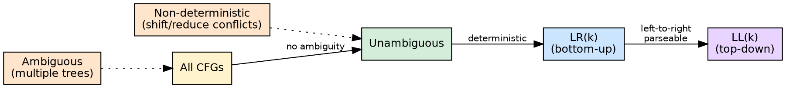
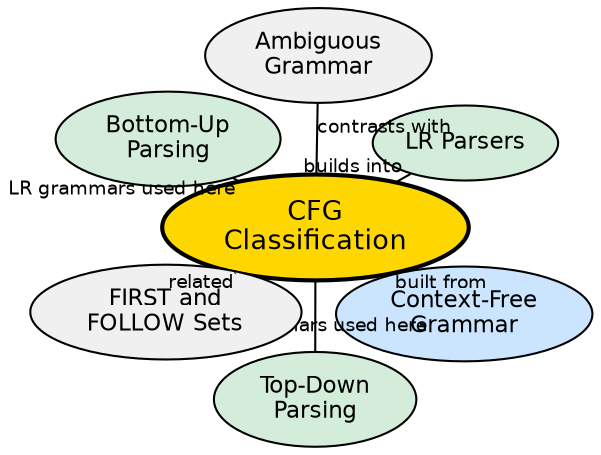

## The Problem

Not all context-free grammars are equally useful for parsing. Some grammars are ambiguous (producing multiple parse trees), some contain left recursion (breaking top-down parsers), and some require unbounded lookahead. A classification system helps parser designers choose or transform grammars for the target parsing strategy.

## Core Idea

Context-free grammars are classified by their properties relevant to parsing: **ambiguous vs unambiguous**, **left-recursive vs non-left-recursive**, **LL(k)** (parseable with k lookahead top-down), and **LR(k)** (parseable with k lookahead bottom-up). Every LL grammar is also LR, but not vice versa. Grammars can often be transformed (left-recursion elimination, left-factoring) to fit a desired class.

## How It Works

A grammar is **ambiguous** if some string has more than one leftmost derivation. A grammar is **left-recursive** if a non-terminal derives a string starting with itself (direct: `A → Aα`, or indirect: `A → Bβ, B → Aγ`). A grammar is **LL(k)** if for every non-terminal and every k-token lookahead, exactly one production can be chosen. A grammar is **LR(k)** if handle identification can be done with k lookahead. The class hierarchy: `LL ⊂ LR ⊂ unambiguous CFG ⊂ CFG`.

## Visual Explanation

## Semantic Network

## Key Properties

- **Ambiguous:** Multiple parse trees for the same string — problematic for deterministic parsing
- **Left-recursive:** Direct or indirect recursion on the left — fatal for top-down parsers
- **LL(k):** Deterministic top-down parseable with k-token lookahead — requires left-factoring
- **LR(k):** Deterministic bottom-up parseable with k-token lookahead — more powerful than LL
- **Hierarchy:** Every LL grammar is LR, but LR grammars include non-LL languages (e.g., left-recursive expressions)

## Connections

- **Built from:** [[context-free-grammar|Context-Free Grammar]] — CFG is the formal foundation being classified
- **Builds into:** [[top-down-parsing|Top-Down Parsing]] — requires non-left-recursive, LL(k) grammars
- **Builds into:** [[lr-parsers|LR Parsers]] — LR(k) grammars are the input class for LR parser generators
- **Related:** [[wiki/compilerdesign/ambiguous-grammar|Ambiguous Grammar]] — ambiguity is a key classification dimension
- **Related:** [[first-and-follow-sets|FIRST and FOLLOW Sets]] — used to determine if a grammar is LL(1)

## Edge Cases & Gotchas

- **LL(1) ≠ LL(k):** A grammar may not be LL(1) but may be LL(2) — increasing lookahead increases power
- **LR(0) < SLR < LALR < CLR:** Within LR family, each subclass handles a larger set of grammars
- **Grammar transformation:** Left-recursive grammars can be mechanically transformed to non-left-recursive, but the resulting grammar may be harder to read
- **Inherently ambiguous languages:** Some languages are inherently ambiguous — no unambiguous grammar exists for them

## Sources

- [[cd2-summary|Compiler Design for GATE Exam]] — covers classification of context-free grammars for parsing
