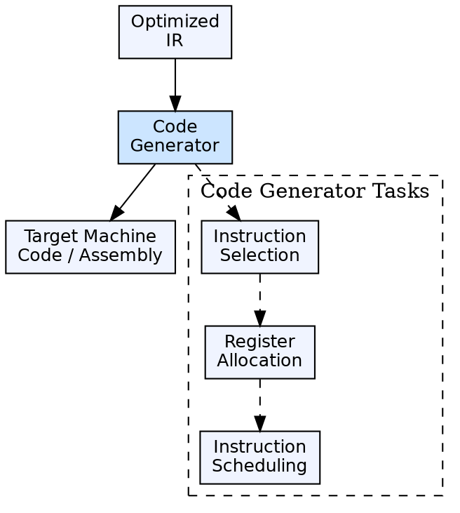

## The Problem

After analysis and optimization, the compiler holds an optimized intermediate representation. This IR must be translated into actual machine instructions (or assembly) that the target processor can execute — including instruction selection, register allocation, and addressing mode decisions.

## Core Idea

Code generation is the final phase of a compiler. It takes the optimized intermediate representation and produces target machine code (or assembly). The generated code must be correct, efficient, and make effective use of the target architecture's resources (registers, memory, instruction set).

## How It Works

The code generator performs three key tasks: **instruction selection** (mapping IR operations to target instructions), **register allocation** (assigning variables to CPU registers), and **instruction ordering** (scheduling instructions for efficiency). It produces relocatable object code or assembly that is passed to an assembler or linker.

## Visual Explanation

## Key Properties

- **Input:** Optimized intermediate representation
- **Output:** Target machine code (assembly or binary)
- **Three tasks:** Instruction selection, register allocation, instruction scheduling
- **Target-dependent:** The code generator is specific to the target architecture
- **Produces:** Object code that the linker/loader handles next

## Connections

- **Built from:** [[code-optimization|Code Optimization]] — consumes optimized IR
- **Built from:** [[code-generator-design-issues|Issues in Code Generator Design]] — design considerations for building a code generator
- **Builds into:** [[object-code|Object Code]] — produces the object code output
- **Related:** [[phases-of-compiler|Phases of a Compiler]] — code generation is phase 6, the final phase
- **Related:** [[linker-and-loader|Linker and Loader]] — the code generator produces object files that the linker resolves

## Edge Cases & Gotchas

- **Register spilling:** When there are more live variables than registers, some must be spilled to memory — frequent spilling destroys performance
- **Strange instructions:** Some architectures have complex instructions (VLIW, SIMD) that require careful pattern matching during instruction selection
- **PIC vs absolute code:** Position-independent code requires different addressing strategies than absolute code