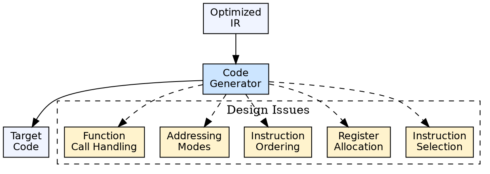

## The Problem

Generating correct and efficient target code from intermediate representation is not straightforward. The code generator must make complex decisions — which instructions to use, which registers to allocate, how to handle memory — each affecting correctness, performance, and code size.

## Core Idea

The design of a code generator involves several critical issues: **instruction selection** (mapping IR to target instructions), **register allocation** (assigning variables to limited CPU registers), **instruction ordering** (scheduling for pipeline efficiency), **addressing modes** (choosing how to access memory), and **handling of special constructs** (function calls, aliasing, runtime checks).

## How It Works

The code generator walks the IR and for each operation, selects one or more target instructions. It maintains a register descriptor (which variable is in which register) and an address descriptor (where each variable's current value is located). When variables outnumber registers, some must be **spilled** to memory. The generator must also handle calling conventions and runtime interface.

## Visual Explanation

## Key Properties

- **Instruction selection:** Pattern matching IR operations to target instructions (e.g., `x = y + 1` → `INC` vs `ADD`)
- **Register allocation:** Graph coloring, linear scan — assigning variables to registers
- **Register spilling:** When registers are exhausted, some values must be stored in memory
- **Addressing modes:** Direct, indirect, indexed, base+offset — different modes have different costs
- **Instruction scheduling:** Reordering instructions for pipeline efficiency without changing semantics

## Connections

- **Built from:** [[code-generation|Code Generation]] — these are the design considerations for implementing a code generator
- **Related:** [[three-address-code|Three-Address Code]] — the IR form that the code generator processes
- **Related:** [[code-optimization|Code Optimization]] — optimization and code generation trade off (e.g., register allocation)
- **Related:** [[object-code|Object Code]] — the output the generator must produce correctly
- **Related:** [[runtime-environment|Runtime Environment]] — calling conventions, stack layout, and memory management affect code generation

## Edge Cases & Gotchas

- **Graph coloring NP-complete:** Optimal register allocation is NP-complete — compilers use heuristics (linear scan, greedy)
- **Aliasing:** If two variables point to the same memory location, the code generator cannot freely reorder operations
- **Peculiar instructions:** Some ISAs have complex instructions (string copy, CRC, SIMD) that require careful pattern matching
- **Self-modifying code:** Rarely needed, but some dynamic code systems require the generator to produce position-independent code