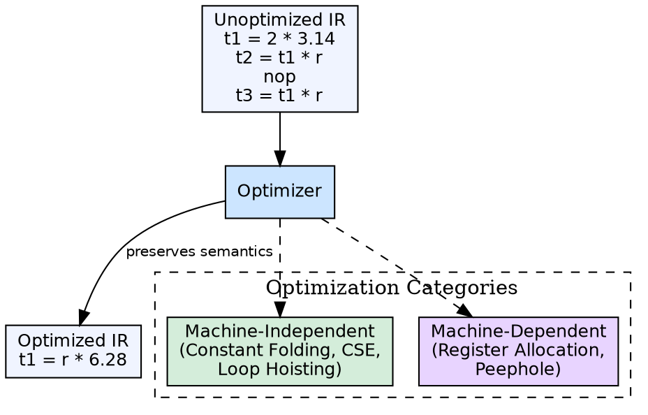

## The Problem

Naively translated code contains redundant computations, dead code, and suboptimal patterns that waste CPU cycles and memory. Hand-optimizing assembly is impractical. The compiler must automatically improve code quality while preserving program semantics.

## Core Idea

Code optimization is the fifth phase of a compiler (and sometimes spans multiple passes). It transforms the intermediate representation into functionally equivalent but more efficient code — faster execution, smaller size, or lower power consumption — by applying algebraic, control-flow, and data-flow transformations.

## How It Works

The optimizer applies a series of transformations. **Machine-independent optimizations** work on IR: constant folding (evaluating constant expressions at compile time), dead code elimination, common subexpression elimination, loop hoisting, and strength reduction. **Machine-dependent optimizations** work during code generation: register allocation, instruction scheduling, and peephole optimization.

## Visual Explanation

## Key Properties

- **Semantics-preserving:** Optimized code must produce the same output for every input
- **Two categories:** Machine-independent (on IR) and machine-dependent (on target)
- **Common techniques:** Constant folding, dead code elimination, CSE, loop optimizations, strength reduction
- **Optimization levels:** Compilers offer multiple levels (O0, O1, O2, O3) trading compile time vs runtime performance

## Connections

- **Built from:** [[intermediate-code-generation|Intermediate Code Generation]] — optimizes the IR
- **Builds into:** [[code-generation|Code Generation]] — optimized IR is passed to the code generator
- **Builds into:** [[three-address-code|Three-Address Code]] — optimizations are often expressed as TAC transformations
- **Related:** [[data-flow-analysis|Data Flow Analysis]] — many optimizations require data-flow analysis to determine safety
- **Related:** [[phases-of-compiler|Phases of a Compiler]] — code optimization is phase 5

## Edge Cases & Gotchas

- **Optimization can hide bugs:** Some optimizations exploit undefined behavior in languages like C, causing working debug builds to break in optimized builds
- **Diminishing returns:** Higher optimization levels (O3 vs O2) often yield marginal gains with significantly longer compile times
- **Code size vs speed:** Some optimizations (loop unrolling, function inlining) increase code size for speed — must be tuned per application