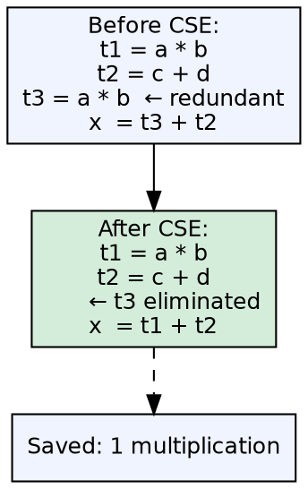
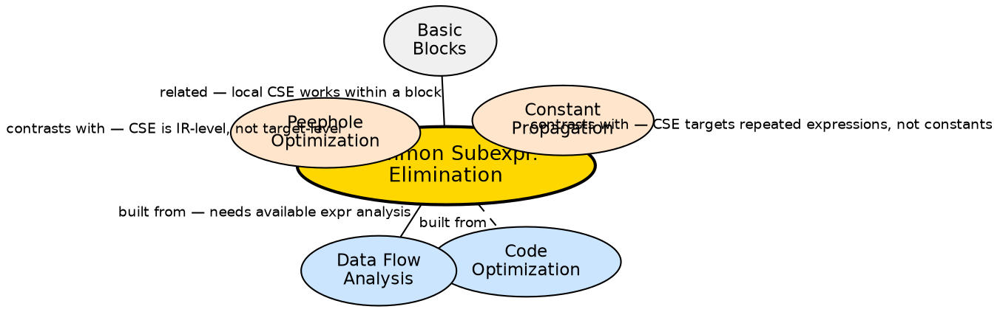

## The Problem

Programs repeatedly compute the same expression multiple times — especially in loops, repeated indexing calculations (`a[i*cols+j]`), and aliased computations. Each redundant computation wastes CPU cycles. The compiler must detect when two expressions compute the same value and reuse the earlier result.

## Core Idea

Common Subexpression Elimination (CSE) is a compiler optimization that identifies expressions that have been computed before and whose operands haven't changed since. It replaces the redundant computation with a reference to the previously computed value. CSE can be **local** (within a single basic block) or **global** (across basic blocks using available-expression analysis).

## How It Works

Local CSE scans a basic block and builds a table of computed expressions. For each new expression `x = a op b`, it checks if `a op b` has already been computed with the same operands and no intervening assignments to `a` or `b`. If found, the new computation is replaced with `x = previous_temp`. Global CSE uses available-expression data-flow analysis to propagate this information across basic blocks in the CFG.

## Visual Explanation

## Semantic Network

## Key Properties

- **Local CSE:** Works within a single basic block — simple and fast
- **Global CSE:** Works across blocks using available-expression data-flow analysis
- **Available expressions:** An expression `a op b` is available at point p if it was computed earlier and operands haven't changed
- **Safety:** Always safe — replacing a computation with a reference to an identical computation preserves semantics
- **Loop benefits:** Most impactful in loops where expressions are repeatedly computed with the same operands

## Connections

- **Built from:** [[code-optimization|Code Optimization]] — CSE is a classic compiler optimization technique
- **Built from:** [[data-flow-analysis|Data Flow Analysis]] — global CSE requires available-expression analysis
- **Contrasts with:** [[peephole-optimization|Peephole Optimization]] — CSE works at the IR level, not the target instruction level
- **Contrasts with:** [[constant-propagation|Constant Propagation]] — CSE targets repeated expression evaluation, not constant values
- **Related:** [[basic-blocks|Basic Blocks]] — local CSE operates within a single basic block

## Edge Cases & Gotchas

- **Operand aliasing:** If `a` and `b` can be modified through pointers between the two computations, CSE cannot safely eliminate the redundant computation
- **Cost trade-off:** CSE increases register pressure by keeping more values live — may slow down register allocation
- **Global CSE complexity:** Available-expression analysis is more complex than reaching-definitions analysis because expressions involve multiple variables
- **Partial redundancy:** When an expression is available on some paths but not all — partial redundancy elimination (PRE) is a more sophisticated optimization