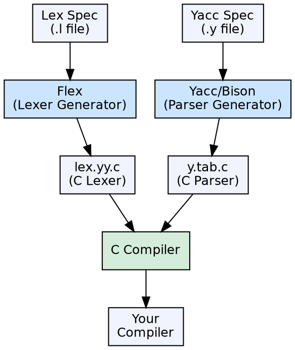

## The Problem

Building a compiler from scratch requires implementing scanners, parsers, code generators, and optimizers — each involving complex algorithms (finite automata, LR parsing, graph coloring). Writing these manually for every new compiler is repetitive, error-prone, and time-consuming.

## Core Idea

Compiler construction tools are specialized software that automate parts of compiler development. **Lex/Flex** generates lexical analyzers from regular expression specifications. **Yacc/Bison** generates parsers from grammar specifications. Other tools handle code generation, optimization, and symbol table management.

## How It Works

The developer writes high-level specifications: regular expressions for tokens (Lex) and context-free grammar rules with actions (Yacc). The tool generates source code (typically C) that implements the scanner or parser. The generated code is compiled and linked with the rest of the compiler. This approach reduces development time and eliminates manual implementation errors.

## Visual Explanation

## Key Properties

- **Lexer generators:** Flex, Lex — input: regex patterns → output: DFA-based lexer in C
- **Parser generators:** Yacc, Bison — input: CFG grammar → output: LALR(1) parser in C
- **Reduces manual work:** Automatically generates complex automata algorithms
- **Separation of concerns:** Developer focuses on language specification, not implementation
- **Integrated tools:** Lex and Yacc are designed to work together — tokens defined in Lex are used in Yacc

## Connections

- **Built from:** [[lexical-analysis|Lexical Analysis]] — Flex generates lexers that perform lexical analysis
- **Built from:** [[syntax-analysis|Syntax Analysis]] — Yacc generates parsers for syntax analysis
- **Related:** [[flex-lexical-analyzer-generator|Flex]] — Fast Lexical Analyzer Generator, the modern version of Lex
- **Related:** [[lr-parsers|LALR Parser]] — Yacc generates LALR(1) parsers
- **Related:** [[compiler|Compiler]] — these tools are used to build compilers

## Edge Cases & Gotchas

- **Tool dependencies:** Generated code often requires libraries from the tool (e.g., yacc's yyparse needs yylex from lex)
- **LALR limitations:** Yacc uses LALR(1) which cannot handle all grammars — ambiguous or LR(1)-only grammars need workarounds
- **Modern alternatives:** ANTLR generates LL(*) parsers for multiple languages; LLVM provides code generation IR tools

## Sources

- [[compilerdesign-summary|Compiler Design Tutorial]] — covers compiler construction tools as part of introduction
