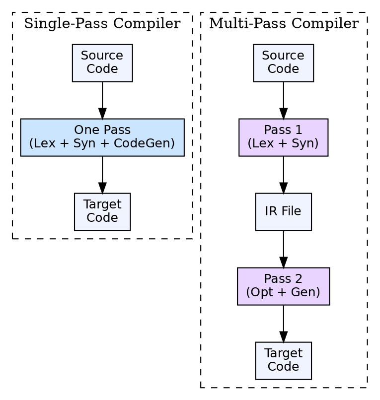

## The Problem

Compiler phases produce intermediate data (tokens, parse trees, IR) that must be stored between phases. Reading and writing this intermediate data to memory or disk has a cost. The compiler designer must decide how many times to scan the program and how much intermediate data to materialize.

## Core Idea

A pass is a complete scan of the input (source code or intermediate representation) by a compiler. A **single-pass** compiler processes the source code once, combining multiple phases into one scan. A **multi-pass** compiler makes multiple scans, materializing intermediate representations between passes.

## How It Works

In a single-pass compiler, lexical analysis, syntax analysis, and code generation are interleaved. As the parser recognizes a construct, it emits code immediately. In a multi-pass compiler, each phase runs as a separate pass, writing its output to a file or memory structure that the next pass reads. Pascal uses a single pass; C uses multiple passes.

## Visual Explanation

## Key Properties

- **Single-pass:** Faster compilation, less memory, tighter coupling of phases
- **Multi-pass:** Better code quality, modular compiler design, supports optimization
- **Language constraints:** Some languages require multi-pass (forward references, C requires seeing struct definitions before use)
- **Intermediate files:** Multi-pass compilers read/write intermediate representation between passes

## Connections

- **Built from:** [[phases-of-compiler|Phases of a Compiler]] — passes group phases into scans
- **Contrasts with:** [[single-pass-vs-multi-pass|Single Pass vs Multi-Pass Compiler]] — synthesis comparing the two strategies
- **Related:** [[compiler|Compiler]] — the overall architecture of a compiler
- **Related:** [[code-optimization|Code Optimization]] — optimization typically requires multiple passes for effective transformation

## Edge Cases & Gotchas

- **Hybrid approaches:** Modern compilers like GCC and LLVM are multi-pass but use efficient in-memory IR, not files between passes
- **Pascal is single-pass:** Pascal was designed specifically to allow single-pass compilation — no forward references without explicit forward declaration
- **Multi-pass enables optimization:** Dead code elimination, constant propagation, and loop transformations all require multiple passes to analyze