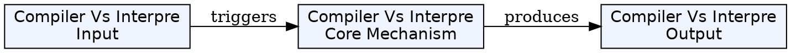
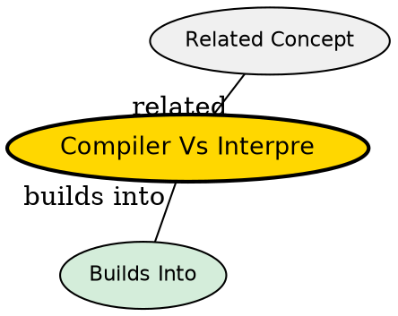

## What's Being Compared

Both compilers and interpreters translate high-level language to executable form, but they differ fundamentally in when and how translation happens. This distinction shapes language design, tooling, debugging, and deployment.

## The Core Tension

A compiler translates the entire source program before execution, producing a separate executable. An interpreter translates and executes the program line by line during execution. The trade-off is between runtime performance (compiler) and development flexibility (interpreter).

## Comparison

| Dimension | [[compiler|Compiler]] | [[compiler|Interpreter]] |
|-----------|--------------|----------------|
| Translation | Entire program ahead of time | Line by line during execution |
| Execution speed | Fast (pre-compiled) | Slow (translation overhead at runtime) |
| Output | Separate executable file | No separate file -- runs immediately |
| Debugging | Harder (disconnected from source) | Easier (direct source interaction) |
| Error detection | Before execution (compile time) | During execution (runtime) |
| Memory usage | Lower at runtime | Higher (translator stays in memory) |
| Portability | Recompile for each target | Run interpreter on each target |
| Security | Source not distributed | Source (or bytecode) must be present |

## When to Choose Compiler

- Performance-critical applications
- Production deployment (fast startup and execution)
- Applications distributed without source
- Languages with static typing and compile-time checks

## When to Choose Interpreter

- Rapid prototyping and development
- Scripting and glue code
- Interactive programming environments (REPLs)
- Educational settings

## The Insight

Modern languages blur the distinction -- Java is compiled to bytecode (by javac) then interpreted/JIT-compiled by the JVM. Python compiles to bytecode (.pyc) before interpretation. The practical reality is a spectrum from pure compilation (C, Go) through JIT compilation (Java, C#) to pure interpretation (bash, early Python).

## Visual Explanation

## Semantic Network

## Connections

- [[compiler|Compiler]] -- the compiled approach, left side of comparison
- [[phases-of-compiler|Phases of a Compiler]] -- compilation involves multiple distinct phases
- [[compiler-pass|Compiler Pass]] -- how compilers organize translation into passes
- [[intermediate-code-generation|Intermediate Code Generation]] -- bytecode is a form of IR used by both compilers and interpreters
- [[runtime-environment|Runtime Environment]] -- interpreters require a runtime environment while executing