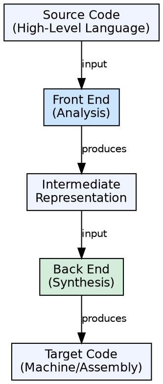
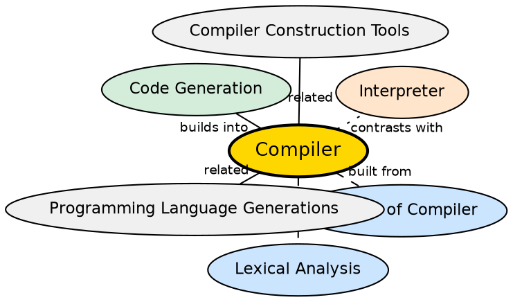

## The Problem

High-level programming languages (C, C++, Java, Python) are human-readable but machines only understand binary machine code. Without a compiler, every program would need to be written in assembly or machine code — a tedious, error-prone, and non-portable process.

## Core Idea

A compiler is software that translates a program written in a high-level source language into an equivalent low-level target language (machine code or assembly). It acts as the bridge between human-readable code and machine-understandable instructions, automating translation, checking correctness, and reporting errors.

## How It Works

A compiler operates in multiple phases organized into two major parts: the **analysis (front-end)** and **synthesis (back-end)**. The front-end analyzes the source program and creates an intermediate representation. The back-end uses this representation to generate target code. The phases include lexical analysis, syntax analysis, semantic analysis, intermediate code generation, code optimization, and final code generation.

## Visual Explanation

## Semantic Network

## Key Properties

- **Two-part architecture:** Front-end (analysis) + Back-end (synthesis)
- **Language translation:** Source language → Target language (not execution)
- **Error detection:** Reports lexical, syntactic, and semantic errors
- **Portability:** Same source can be compiled for different target machines
- **Optimization:** Can improve code quality without changing semantics

## Connections

- **Built from:** [[phases-of-compiler|Phases of a Compiler]] — the compiler's internal pipeline is organized into distinct phases
- **Built from:** [[lexical-analysis|Lexical Analysis]] — first phase that breaks source into tokens
- **Built from:** [[syntax-analysis|Syntax Analysis]] — verifies grammatical structure during compilation
- **Contrasts with:** [[compiler-vs-interpreter|Compiler vs Interpreter]] — compiler translates then stops; interpreter executes as it translates
- **Related:** [[wiki/compilerdesign/compiler-construction-tools|Compiler Construction Tools]] — tools like Lex and Yacc automate parts of compiler creation
- **Related:** [[programming-language-generations|Programming Language Generations]] — compilers are essential for higher-generation languages

## Edge Cases & Gotchas

- **Compiler vs Cross-Compiler:** A compiler that runs on one platform but generates code for a different platform is a cross-compiler
- **Just-In-Time Compilation:** Modern JVMs use JIT compilation — bytecode is compiled to native code at runtime, blurring the line between compiler and interpreter
- **Incremental Compilation:** Not all compilers recompile everything — many (like javac) support incremental compilation for faster development cycles