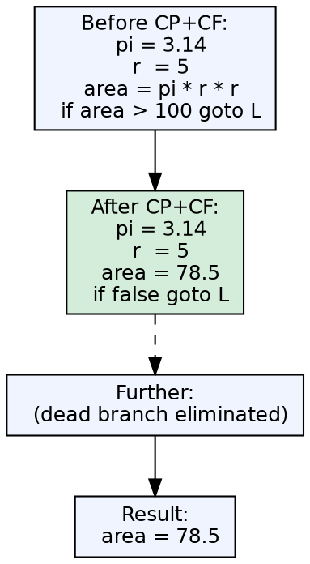
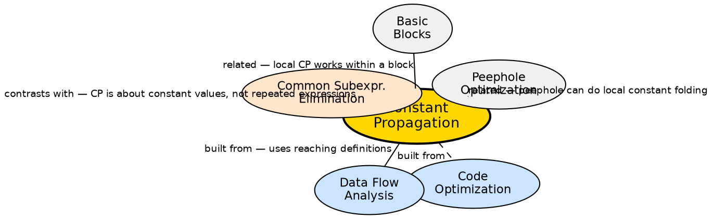

## The Problem

Source code often contains expressions whose operands are all known at compile time — either literal constants or variables that can only hold one value. Evaluating these at runtime wastes cycles. The compiler should replace them with their computed values and propagate those values through subsequent uses.

## Core Idea

Constant propagation replaces variables whose values are known at compile time with their constant values, and constant folding evaluates constant expressions at compile time. If `x = 5` and later `y = x * 2`, the compiler replaces this with `y = 10`. This eliminates runtime computation and often enables further optimizations (dead code elimination, branch elimination).

## How It Works

The compiler tracks which variables hold known constant values at each program point. It starts by identifying assignments of constants to variables (`x = 5`). For each subsequent use of `x`, if no intervening assignment has changed `x`, it replaces `x` with `5`. When a constant expression is formed (e.g., `5 * 2`), constant folding evaluates it at compile time (`10`). This propagates forward — simplifications create more opportunities for propagation. Reaching-definitions analysis determines which assignments reach which uses.

## Visual Explanation

## Semantic Network

## Key Properties

- **Constant propagation:** Replacing variable uses with known constant values
- **Constant folding:** Evaluating constant expressions at compile time (e.g., `2 * 3.14` → `6.28`)
- **Cascading:** CP creates more constant expressions, CF evaluates them, creating more CP opportunities
- **Reaching definitions:** Used to determine which assignments reach which variable uses
- **Conditional branches:** CP can simplify conditional expressions, enabling dead branch elimination

## Connections

- **Built from:** [[code-optimization|Code Optimization]] — CP/CF is a fundamental optimization technique
- **Built from:** [[data-flow-analysis|Data Flow Analysis]] — reaching-definitions analysis drives global CP
- **Contrasts with:** [[common-subexpression-elimination|Common Subexpression Elimination]] — CP simplifies constant expressions; CSE eliminates redundant computations
- **Related:** [[peephole-optimization|Peephole Optimization]] — local constant folding can be done as a peephole optimization on target code
- **Related:** [[basic-blocks|Basic Blocks]] — local CP works within a single block; global CP needs the CFG

## Edge Cases & Gotchas

- **Over-approximation:** The analysis must be conservative — if a variable might have been modified (e.g., through a pointer), CP cannot assume its previous constant value
- **Conditional constant propagation:** When a variable is constant on one branch but not another, the analysis must handle this precisely
- **Sparse conditional constant propagation (SCCP):** A more powerful form that simultaneously tracks constants and reachability
- **Not always beneficial:** Propagating a constant may increase code size (different constants propagated to different uses) without runtime benefit

## Sources

- [[cd2-summary|Compiler Design for GATE Exam]] — covers constant propagation as a data-flow analysis and optimization technique
