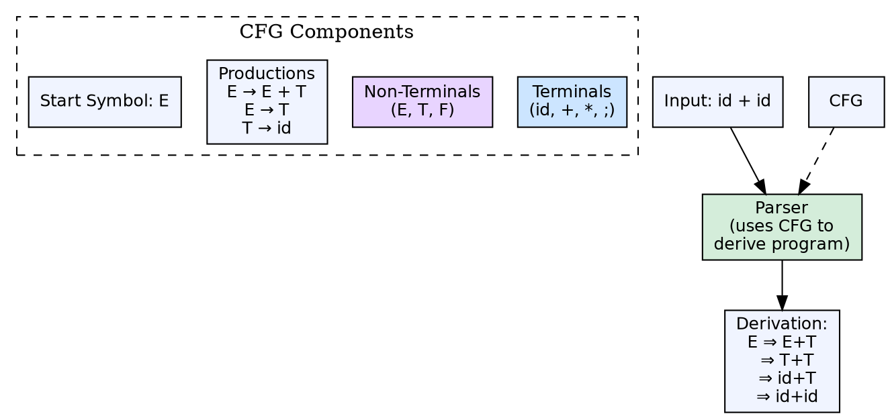

## The Problem

Natural language descriptions of syntax ("an if statement consists of the keyword if, followed by a parenthesized expression, followed by a statement") are imprecise, ambiguous, and cannot be processed by software. The compiler needs a formal, precise, and machine-readable specification of the language's syntax.

## Core Idea

A context-free grammar (CFG) is a formal system for specifying the syntax of a programming language. It consists of a set of **production rules** of the form A → α, where A is a non-terminal and α is a string of terminals and non-terminals. CFGs are the input specification for parser generators and form the foundation of syntax analysis.

## How It Works

A CFG has four components: a set of **terminals** (tokens), a set of **non-terminals** (syntactic variables), a **start symbol** (top-level non-terminal), and **productions** (rules). For example, `E → E + T | T` and `T → id | num`. The parser uses these rules to derive the source program through a sequence of replacements. The set of all strings derivable from the start symbol is the language defined by the grammar.

## Visual Explanation

## Key Properties

- **Formal definition:** G = (V, Σ, R, S) — non-terminals, terminals, productions, start symbol
- **BNF notation:** Backus-Naur Form is the standard notation for writing CFGs
- **Derivation:** Replacing non-terminals with right-hand sides of productions
- **Parse tree:** Graphical representation of a derivation
- **Language:** Set of all strings derivable from the start symbol

## Connections

- **Built from:** [[syntax-analysis|Syntax Analysis]] — the parser uses a CFG to validate program structure
- **Builds into:** [[wiki/compilerdesign/ambiguous-grammar|Ambiguous Grammar]] — a grammar that produces multiple parse trees for the same input
- **Builds into:** [[top-down-parsing|Top-Down Parsing]] — top-down parsers follow leftmost derivations from a CFG
- **Builds into:** [[bottom-up-parsing|Bottom-Up Parsing]] — bottom-up parsers compute reverse rightmost derivations from a CFG
- **Related:** [[first-and-follow-sets|FIRST and FOLLOW Sets]] — computed from CFG to guide parser table construction
- **Related:** [[context-free-grammar|Context-Free Grammar]] — CFGs are categorized by production rule structure into regular, context-free, context-sensitive, and unrestricted

## Edge Cases & Gotchas

- **Left recursion:** Top-down parsers enter infinite loops with left-recursive productions (A → Aα)
- **Ambiguity:** A grammar may be ambiguous even though the language is not — the grammar must be rewritten
- **Grammar transformations:** Left recursion elimination and left factoring are common transformations to make grammars parseable

## Sources

- [[compilerdesign-summary|Compiler Design Tutorial]] — covers CFG classification for syntax analysis
