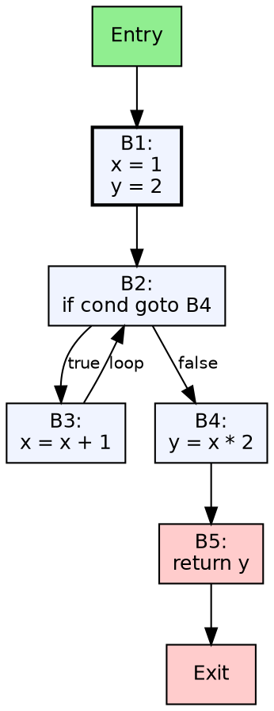
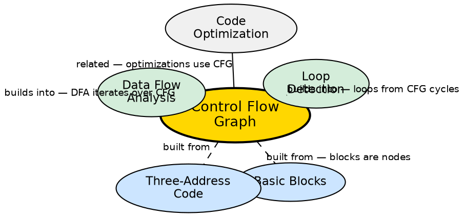

## The Problem

A basic block captures straight-line code, but programs have branches, loops, and conditional execution. The compiler needs a global view of how control flows between blocks to perform inter-block optimizations, data-flow analysis, and loop detection. Without a control-flow graph, each block is an island — no analysis can cross block boundaries.

## Core Idea

A control-flow graph (CFG) is a directed graph where nodes are **basic blocks** and edges represent potential control flow paths. There is a directed edge from block A to block B if control can pass from the last instruction of A to the first instruction of B (via jump, fall-through, or call). The CFG has a unique **entry node** (start of the program) and typically one or more **exit nodes** (program termination points).

## How It Works

The CFG is constructed after basic block identification. For each block, the compiler examines its last instruction: if it ends with a conditional jump `if X goto L`, edges go to the block starting with label `L` and to the next block (fall-through). If it ends with an unconditional jump `goto L`, a single edge goes to L's block. If it ends with a return, it's an exit node. The resulting graph is the framework for all global compiler analysis and optimization.

## Visual Explanation

## Semantic Network

## Key Properties

- **Directed graph:** Nodes = basic blocks, Edges = control flow
- **Unique entry:** Single entry node (start of the program)
- **Edges represent jumps:** Conditional, unconditional, and fall-through
- **Cycle = loop:** Back edges in the CFG identify loops (using dominator analysis)
- **Framework for analysis:** All global data-flow analysis works by iterating over the CFG

## Connections

- **Built from:** [[basic-blocks|Basic Blocks]] — blocks are the nodes of the CFG
- **Builds into:** [[data-flow-analysis|Data Flow Analysis]] — DFA uses the CFG to propagate information across blocks
- **Builds into:** [[loop-detection-in-tac|Detection of a Loop in TAC]] — loops are identified by analyzing back edges in the CFG
- **Related:** [[code-optimization|Code Optimization]] — many optimizations use the CFG to determine safe transformation scope
- **Related:** [[intermediate-code-generation|Intermediate Code Generation]] — ICG produces the TAC that the CFG represents
- **Related:** [[code-generator-design-issues|Issues in Code Generator Design]] — code generators use CFG for instruction scheduling and register allocation

## Edge Cases & Gotchas

- **Irreducible CFG:** When gotos create multiple-entry loops, the CFG is irreducible — some analyses cannot handle this
- **Dead code:** Blocks unreachable from the entry are dead code and can be removed
- **Critical edges:** Edges from blocks with multiple successors to blocks with multiple predecessors — they complicate code motion optimizations
- **CFG explosion:** For large programs, the CFG can have thousands of nodes — iterative analysis must be efficient

## Sources

- [[cd2-summary|Compiler Design for GATE Exam]] — covers control flow graphs in intermediate code generation
