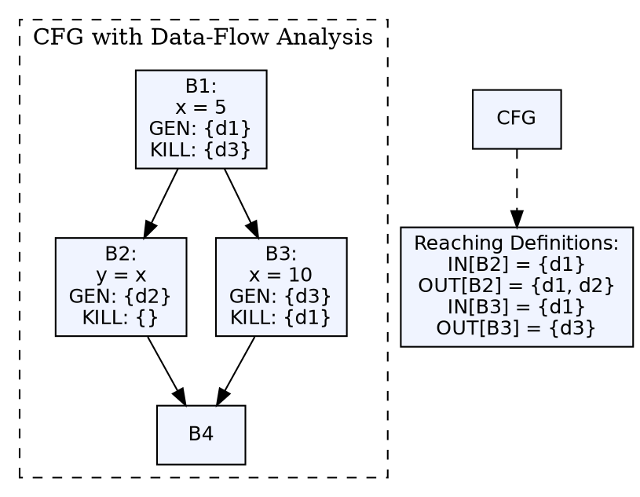

## The Problem

Many compiler optimizations require knowing how data moves through the program — which definitions reach which uses, which variables are live at which points, which expressions are available. Without data-flow analysis, the compiler cannot safely apply transformations because it doesn't know if they preserve program semantics.

## Core Idea

Data-flow analysis is a technique for collecting information about the possible values computed at various points in a program. It solves **data-flow equations** over the control-flow graph to determine properties like **reaching definitions** (which assignments reach a given point), **live variables** (variables that will be used later), and **available expressions** (expressions already computed).

## How It Works

Data-flow analysis works on the CFG of basic blocks. For each basic block, the compiler computes **GEN** (definitions/expressions generated within the block) and **KILL** (definitions/expressions that become invalid). Data-flow equations propagate these sets across block boundaries until a fixed point is reached. The direction of propagation depends on the analysis type: forward (reaching definitions) or backward (live variables).

## Visual Explanation

## Key Properties

- **Reaching definitions:** Which definition points can reach a program point
- **Live variable analysis:** Which variables will be used before being redefined
- **Available expressions:** Which expressions have already been computed
- **Data-flow equations:** IN[B] = ∪OUT[predecessors]; OUT[B] = GEN[B] ∪ (IN[B] - KILL[B])
- **Fixed-point iteration:** Analysis iterates until the sets stabilize (no more changes)

## Connections

- **Built from:** [[three-address-code|Three-Address Code]] — data-flow analysis operates on TAC basic blocks
- **Builds into:** [[code-optimization|Code Optimization]] — optimizations like dead code elimination and constant propagation need data-flow info
- **Related:** [[loop-detection-in-tac|Detection of a Loop in TAC]] — loops require data-flow analysis for effective optimization
- **Related:** [[code-generator-design-issues|Issues in Code Generator Design]] — register allocation uses live variable analysis
- **Related:** [[intermediate-code-generation|Intermediate Code Generation]] — IR in TAC form enables data-flow analysis

## Edge Cases & Gotchas

- **Conservative approximation:** Data-flow analysis must be conservative (safe) — if it cannot determine a property, it assumes the worst case
- **Pointers and aliasing:** When variables can be accessed through pointers, tracking definitions becomes imprecise
- **Control flow complexity:** Irreducible control flow (gotos, multiple entries) complicates data-flow analysis
- **Array accesses:** `a[i]` and `a[j]` may or may not access the same location if i ≠ j — analysis must be conservative