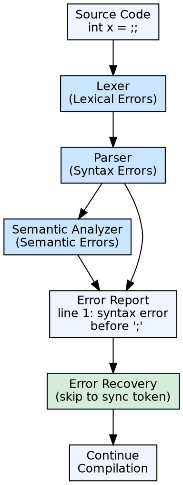

## The Problem

Programs contain errors — typos, missing semicolons, type mismatches, undeclared variables. A compiler that stops at the first error forces users into a painful edit-compile-fix cycle, one error at a time. Without effective error handling, compilation is slow and frustrating.

## Core Idea

Error handling in a compiler encompasses detecting errors, reporting them clearly, and recovering to find more errors in the same compilation. Errors are categorized as **lexical** (invalid characters), **syntax** (grammar violations), **semantic** (type mismatches, undeclared identifiers), and **logical** (runtime issues, detected by the programmer).

## How It Works

Each compiler phase can detect errors relevant to its domain. The lexer flags illegal characters. The parser reports syntax violations and uses recovery strategies (panic mode, error productions) to continue parsing. The semantic analyzer reports type and scope errors. Error messages include the error type, location (line/column), and a descriptive message.

## Visual Explanation

## Key Properties

- **Error categories:** Lexical, syntax, semantic, logical
- **Recovery strategies:** Panic mode (skip to sync token), phrase-level (local fix), error productions (extend grammar), global correction (minimal change)
- **Reporting format:** Error type + location + description
- **Error count:** Compilers typically report all errors found, not just the first
- **Warnings vs Errors:** Warnings don't stop compilation; errors do

## Connections

- **Built from:** [[lexical-analysis|Lexical Analysis]] — detects illegal character sequences
- **Built from:** [[syntax-analysis|Syntax Analysis]] — detects grammar violations
- **Built from:** [[semantic-analysis|Semantic Analysis]] — detects type and scope errors
- **Related:** [[phases-of-compiler|Phases of a Compiler]] — error handling is distributed across all phases
- **Related:** [[compiler|Compiler]] — error handling is a key objective of compiler design

## Edge Cases & Gotchas

- **Cascading errors:** One error can cause a cascade of spurious errors — if a semicolon is missing, the parser may report dozens of subsequent errors before recovering
- **Recovery is heuristic:** No error recovery strategy works perfectly for all languages or all error types
- **IDE integration:** Modern development relies on incremental compilation and real-time error checking — different error reporting strategy than batch compilation