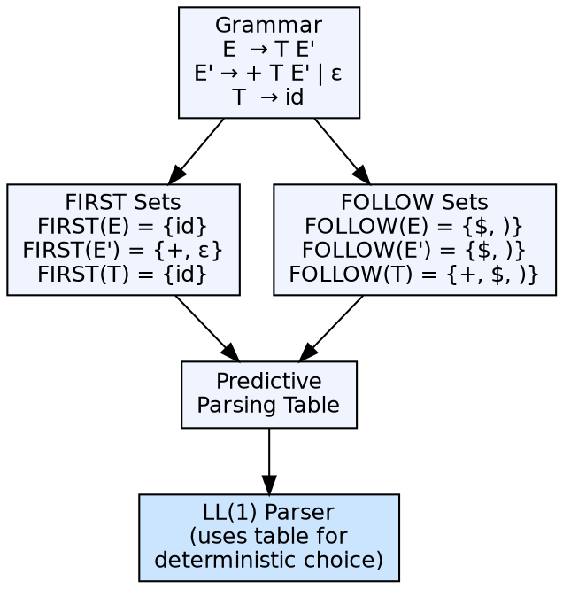

## The Problem

Top-down predictive parsers need to decide which production to apply based on the current input token. Without knowing which tokens can begin a non-terminal's expansion (FIRST) and which tokens can follow a non-terminal (FOLLOW), the parser cannot make deterministic decisions.

## Core Idea

**FIRST(α)** is the set of terminal symbols that can begin strings derived from α. **FOLLOW(A)** is the set of terminal symbols that can appear immediately after A in some sentential form. These sets are computed from a context-free grammar and used to construct predictive parsing tables.

## How It Works

FIRST sets are computed bottom-up: for each production A → X₁X₂...Xₙ, add FIRST(X₁) to FIRST(A). If X₁ can derive ε, add FIRST(X₂), and so on. FOLLOW sets are computed top-down: add $ (end marker) to FOLLOW(S). For each production A → αBβ, add FIRST(β) (minus ε) to FOLLOW(B). If β ⇒ ε, add FOLLOW(A) to FOLLOW(B).

## Visual Explanation

## Key Properties

- **FIRST(X):** Terminals that begin X, plus ε if X ⇒ ε
- **FOLLOW(A):** Terminals that can follow A in a derivation
- **Algorithm:** FIRST is computed iteratively; FOLLOW requires computing nullable non-terminals first
- **LL(1) condition:** No conflict in parsing table — for each A and each terminal a, at most one production applies

## Connections

- **Built from:** [[context-free-grammar|Context-Free Grammar]] — FIRST/FOLLOW are computed from production rules
- **Builds into:** [[top-down-parsing|Top-Down Parsing]] — LL(1) parsers use FIRST/FOLLOW for predictive parsing tables
- **Related:** [[syntax-analysis|Syntax Analysis]] — parsing uses FIRST/FOLLOW to guide decisions
- **Related:** [[wiki/compilerdesign/ambiguous-grammar|Ambiguous Grammar]] — ambiguity can cause FIRST/FOLLOW conflicts in parsing tables

## Edge Cases & Gotchas

- **Nullable non-terminals:** Non-terminals that derive ε complicate FIRST computation — ε propagates through chains
- **Left recursion:** Left-recursive grammars cause infinite loops in FIRST computation — must be eliminated first
- **LL(1) conflicts:** FIRST/FIRST conflict (two productions start with same token) or FIRST/FOLLOW conflict (production can derive ε and the next token is in FOLLOW) make a grammar not LL(1)