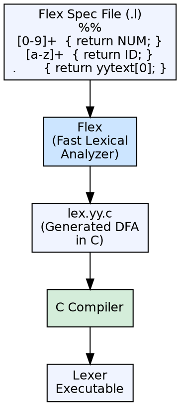

## The Problem

Writing a lexical analyzer manually requires implementing a deterministic finite automaton (DFA) from regular expressions — handling character transitions, accepting states, maximal munch, and error handling. This is tedious, error-prone, and must be redone for each language.

## Core Idea

Flex (Fast Lexical Analyzer Generator) is a tool that automatically generates a lexical analyzer in C from a specification file containing regular expression patterns and corresponding actions. It is the modern open-source replacement for the classic Lex tool.

## How It Works

The developer writes a `.l` specification file with three sections: definitions (character classes, constants), rules (regex patterns → C code actions), and user code (helper functions). Flex converts this spec into a DFA implemented as a C source file (`lex.yy.c`). The generated lexer reads input, matches the longest possible token, and executes the associated C action.

## Visual Explanation

## Key Properties

- **Input format:** Flex `.l` specification with definitions, rules, and user code sections
- **Output:** C source file implementing a DFA-based lexer
- **Maximal munch:** Automatically matches the longest possible token
- **Pattern language:** Regular expressions with extensions (character classes, quantifiers)
- **Integration:** Designed to work with Yacc/Bison — tokens defined in Flex are used by the parser

## Connections

- **Built from:** [[lexical-analysis|Lexical Analysis]] — automates lexer generation from regex specifications
- **Builds into:** [[wiki/compilerdesign/compiler-construction-tools|Compiler Construction Tools]] — Flex is one of the standard compiler tools
- **Related:** [[token|Token]] — generated lexer produces token streams
- **Related:** [[syntax-analysis|Syntax Analysis]] — Flex tokens feed into Yacc/Bison parsers

## Edge Cases & Gotchas

- **Start conditions:** Flex supports start conditions for context-sensitive lexing (e.g., different rules inside comments vs regular code)
- **Performance:** Generated lexers are DFA-based, so they run in O(n) time relative to input length
- **Portability:** `lex.yy.c` is standard C, compilable on any system with a C compiler
- **Flex vs Lex:** Flex is faster and generates more efficient code than the original Lex