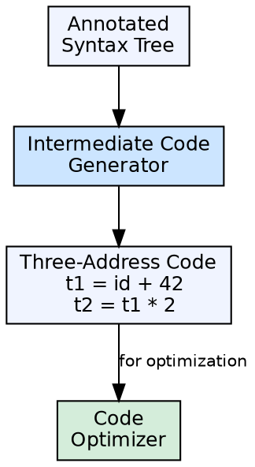

## The Problem

Generating target machine code directly from the annotated syntax tree is complex because different target machines have different architectures, register sets, and instruction sets. A compiler would need a separate code generator for each target, duplicating most of the logic.

## Core Idea

Intermediate code generation is the fourth phase of a compiler. It transforms the annotated syntax tree into a **machine-independent intermediate representation (IR)**. This IR is easier to optimize than source code and easier to translate to multiple target architectures than direct code generation.

## How It Works

The intermediate code generator walks the annotated syntax tree and emits IR instructions. Common IR forms include **three-address code (TAC)** — each instruction has at most three operands — and **static single assignment (SSA)** form. The IR is designed to be high-level enough for optimization but low-level enough for code generation.

## Visual Explanation

## Key Properties

- **Machine-independent:** Same IR can target different architectures
- **Common forms:** Three-address code, SSA form, bytecode
- **Simplifies retargeting:** New target only needs a new code generator from IR
- **Enables optimization:** IR is easier to analyze and transform than source or machine code
- **Decouples front-end from back-end:** Front-end produces IR; back-end consumes IR

## Connections

- **Built from:** [[semantic-analysis|Semantic Analysis]] — consumes the annotated syntax tree
- **Builds into:** [[code-optimization|Code Optimization]] — the IR is the input to optimization
- **Related:** [[three-address-code|Three-Address Code]] — a common IR form where each instruction has ≤ 3 operands
- **Related:** [[phases-of-compiler|Phases of a Compiler]] — intermediate code generation is phase 4
- **Related:** [[code-generation|Code Generation]] — the back-end takes optimized IR and produces target code

## Edge Cases & Gotchas

- **IR forms vary:** Some compilers use multiple IR forms at different levels of abstraction
- **Addressing modes:** Machine-independent IR may not capture all target-specific addressing modes — the code generator handles this mapping
- **SSA vs TAC:** SSA form simplifies optimization but requires phi-nodes; TAC is simpler but requires extra data-flow analysis for optimizations

## Sources

- [[compilerdesign-summary|Compiler Design Tutorial]] — covers intermediate code generation as a key compiler phase
- [[cd2-summary|Compiler Design for GATE Exam]] — covers basic blocks and control flow graphs in ICG
