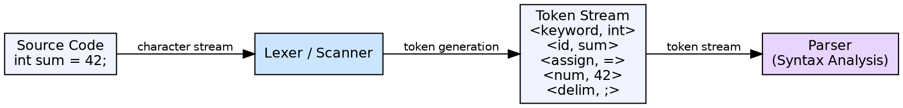

## The Problem

Source code is a sequence of characters (letters, digits, symbols). Compiler phases need meaningful units (keywords, identifiers, operators, literals) — not raw characters. Processing character-by-character throughout compilation would be inefficient and would conflate low-level text processing with high-level grammar analysis.

## Core Idea

Lexical analysis (scanning) is the first phase of a compiler. It reads the source program's character stream and groups characters into meaningful sequences called **tokens**. It discards whitespace and comments, and produces a stream of tokens that the parser consumes.

## How It Works

The lexer scans left-to-right, one character at a time. It uses patterns (typically specified as regular expressions) to recognize token types: keywords (`if`, `while`), identifiers (`count`, `sum`), operators (`+`, `=`), literals (`42`, `"hello"`), and delimiters (`;`, `{`). When a pattern matches, the lexer creates a token pair: `<token-class, attribute-value>`.

## Visual Explanation

## Key Properties

- **Input:** Character stream (source code as text)
- **Output:** Token stream (sequence of <class, value> pairs)
- **Pattern specification:** Uses regular expressions and finite automata
- **Separates concerns:** Simplifies the parser by handling low-level character processing
- **Whitespace/comments:** Stripped during lexical analysis (not passed to parser)

## Connections

- **Built from:** [[token|Token]] — the output unit of lexical analysis, a token is the atomic element
- **Builds into:** [[syntax-analysis|Syntax Analysis]] — parser consumes the token stream from the lexer
- **Related:** [[flex-lexical-analyzer-generator|Flex]] — tool that automates lexer generation from regular expression specifications
- **Related:** [[phases-of-compiler|Phases of a Compiler]] — lexical analysis is the first phase
- **Related:** [[error-handling-in-compiler|Error Handling in Compiler Design]] — lexer detects illegal character sequences

## Edge Cases & Gotchas

- **Maximal munch:** When multiple token patterns match, the lexer picks the longest match (e.g., `==` is one token, not `=` followed by `=` )
- **Lookahead:** Some languages require lookahead to disambiguate tokens (e.g., C's `++x` vs `+ +x`)
- **Context-sensitive lexing:** In some languages, the same character sequence can be different token types depending on context (typedef names in C)