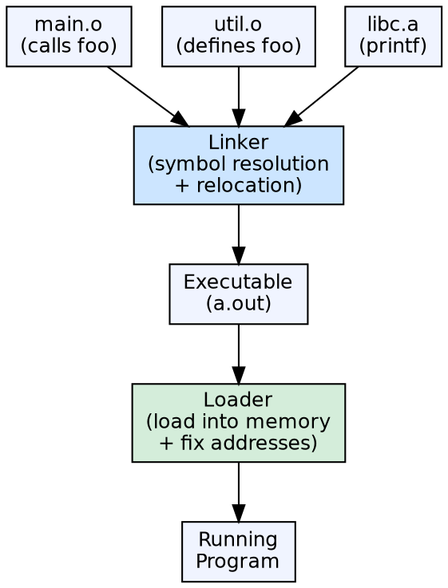

## The Problem

A compiled object file contains unresolved references to functions and variables defined in other files or libraries. Additionally, the object file uses relative addresses that must be adjusted when the code is placed in memory. Without linking and loading, separately compiled modules cannot execute together.

## Core Idea

The **linker** combines multiple object files into a single executable by resolving symbol references (connecting definitions to uses) and performing relocation (adjusting addresses). The **loader** reads the executable from disk into memory, performs final address fixups, and transfers control to the program's entry point.

## How It Works

The linker takes object files and libraries as input. It performs **symbol resolution** — matching each symbol reference to its definition across all input files. It then performs **relocation** — assigning final memory addresses and modifying code/data to use these addresses. The output is an executable file. The loader reads this file, allocates memory, sets up the runtime environment, and jumps to the entry point.

## Visual Explanation

## Key Properties

- **Linker input:** Object files (.o, .obj) and libraries (.a, .lib, .so, .dll)
- **Linker output:** Executable file (or shared library)
- **Symbol resolution:** Matching symbol references to definitions
- **Relocation:** Adjusting addresses to match final memory layout
- **Loader function:** Read executable, allocate memory, resolve dynamic links, start execution

## Connections

- **Built from:** [[object-code|Object Code]] — linkers consume object code produced by compilers
- **Builds into:** [[runtime-environment|Runtime Environment]] — the loader sets up the initial runtime environment
- **Related:** [[code-generation|Code Generation]] — the code generator produces object files for the linker
- **Related:** [[storage-allocation-strategies|Storage Allocation Strategies]] — the loader allocates memory for static data

## Edge Cases & Gotchas

- **Dynamic linking:** Shared libraries (.so, .dll) are linked at load time or runtime, not at compile time — saves memory but adds complexity
- **Link order matters:** Some linkers resolve symbols left-to-right — wrong order causes "undefined reference" errors
- **Circular dependencies:** Libraries that depend on each other can cause linking failures — requires careful library organization
- **Loading time:** Dynamic linking adds startup overhead; static linking creates larger executables but faster startup

## Sources

- [[compilerdesign-summary|Compiler Design Tutorial]] — covers linker and loader as part of runtime environments
- [[cd2-summary|Compiler Design for GATE Exam]] — GATE exam coverage of linking and loading
