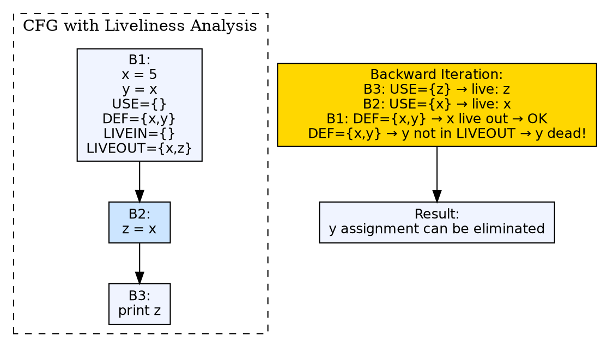

## The Problem

Not all variables hold useful values at all program points. A variable's value after its last use is dead — it can be overwritten without affecting the program result. Register allocation needs to know which values are live at each point (need to stay in a register) and which are dead (register can be reused). Dead code elimination also needs liveness information to remove assignments to dead variables.

## Core Idea

Liveliness analysis (or live variable analysis) is a backward data-flow analysis that determines, for each program point, which variables are **live** — meaning their current value will be used before being reassigned. A variable is live at a point if there exists a path from that point to a use of the variable that does not redefine it. Variables that are not live are dead.

## How It Works

The analysis solves backward data-flow equations over the CFG. For each basic block, it computes `DEF[B]` (variables assigned in B before any use in B) and `USE[B]` (variables used in B before any assignment to them). The equations are: `LIVEOUT[B] = ∪ LIVEIN[successors]`, and `LIVEIN[B] = USE[B] ∪ (LIVEOUT[B] - DEF[B])`. The analysis iterates over all blocks until it reaches a fixed point. A variable is live at a point if it is in the LIVEIN set of any block containing that point.

## Visual Explanation



## Semantic Network

```dot
graph semantic_liveliness {
  layout=neato
  node [shape=ellipse fontname="Helvetica" fontsize=11 style=filled]
  edge [fontname="Helvetica" fontsize=9]

  THIS [label="Liveliness\nAnalysis" fillcolor="#ffd700" fontsize=13 style="filled,bold"]
  PRE1 [label="Data Flow\nAnalysis" fillcolor="#cce5ff"]
  PRE2 [label="Control Flow\nGraph" fillcolor="#cce5ff]
  OUT1 [label="Code\nOptimization" fillcolor="#d4edda"]
  OUT2 [label="Code Generator\nDesign Issues" fillcolor="#d4edda"]
  CON1 [label="Constant\nPropagation" fillcolor="#ffe5cc]

  THIS -- PRE1 [label="built from — backward DFA" style=dashed]
  THIS -- PRE2 [label="built from — iterates over CFG" style=dashed]
  THIS -- OUT1 [label="builds into — dead code elimination"]
  THIS -- OUT2 [label="builds into — register allocation"]
  THIS -- CON1 [label="contrasts with — CP is forward, liveness is backward"]
}
```

## Key Properties

- **Backward analysis:** Information flows backward through the CFG (from exits toward entry)
- **USE/DEF formulation:** USE[B] = variables used before any assignment in B; DEF[B] = variables assigned before any use in B
- **Fixed-point iteration:** Repeats until LIVEOUT sets stabilize across all blocks
- **Dead code elimination:** Variables not live at a point can have their assignment eliminated
- **Register allocation:** Liveness determines which values must be in registers simultaneously

## Connections

- **Built from:** [[data-flow-analysis|Data Flow Analysis]] — liveliness is a canonical example of backward data-flow analysis
- **Built from:** [[control-flow-graph|Control Flow Graph]] — analysis iterates over the CFG's basic blocks
- **Builds into:** [[code-optimization|Code Optimization]] — dead code elimination uses liveness information
- **Builds into:** [[code-generator-design-issues|Issues in Code Generator Design]] — register allocation uses liveness to determine register pressure
- **Contrasts with:** [[constant-propagation|Constant Propagation]] — CP is forward; liveliness is backward

## Edge Cases & Gotchas

- **Mixed liveness:** A variable may be live at the beginning of a block but not at the end — different points in the same block have different liveness
- **Precise vs conservative:** The analysis must be conservative — if it cannot determine liveness precisely, it assumes the variable is live
- **Aliasing:** Through pointers, assignments to `*p` may affect any variable — the analysis must be conservative
- **Optimization interaction:** Dead code elimination from liveness analysis can enable further optimizations, and vice versa

## Sources

- [[cd2-summary|Compiler Design for GATE Exam]] — covers liveliness analysis in data flow analysis
