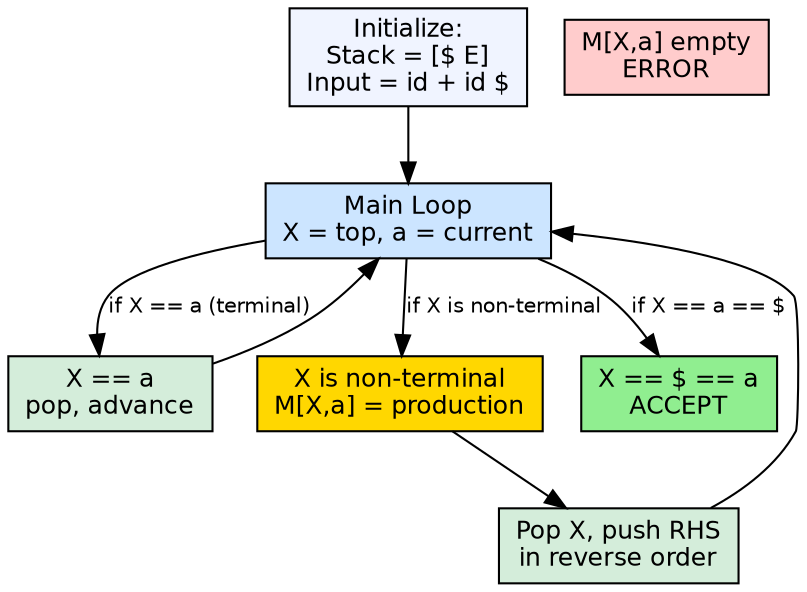
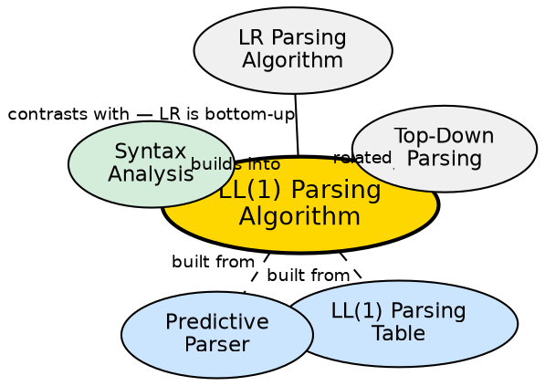

## The Problem

An LL(1) parsing table is a static data structure. It needs an algorithm that reads the table, manages the parse stack, consumes input tokens, and produces a leftmost derivation (or detects syntax errors). The algorithm must be generic — the same driver works for any LL(1) grammar, only the table changes.

## Core Idea

The LL(1) parsing algorithm is a stack-based procedure that uses the parsing table to guide its decisions. It reads the top of stack and the current input token, consults the table to choose a production, and either matches terminals against input or pushes non-terminal right-hand sides onto the stack. It runs in linear time O(n).

## How It Works

Initialize stack with `$` and start symbol. Set input pointer to first token. Repeat: let `X` = top of stack, `a` = current input token. If `X == a == $`, accept. If `X == a ≠ $`, pop stack, advance input. If `X` is a non-terminal, look up `M[X, a]`. If entry contains `X → Y₁Y₂...Yₖ`, pop `X`, push `Yₖ...Y₂Y₁` in reverse order. If entry is empty, report error. The output is the sequence of productions applied — the leftmost derivation.

## Visual Explanation

## Semantic Network

## Key Properties

- **Linear time:** O(n) where n is input length — each token is processed once
- **Stack-based:** Explicit stack replaces recursion
- **Leftmost derivation:** Output is the sequence of productions in a leftmost derivation
- **Error detection:** Found when table entry is empty — immediate detection
- **Generic driver:** The same algorithm works for any LL(1) grammar by swapping the table

## Connections

- **Built from:** [[ll1-parsing-table|LL(1) Parsing Table]] — the algorithm consults this table
- **Built from:** [[predictive-parser|Predictive Parser]] — this is the algorithm that drives the predictive parser
- **Builds into:** [[syntax-analysis|Syntax Analysis]] — the LL(1) algorithm is a concrete syntax analysis method
- **Related:** [[top-down-parsing|Top-Down Parsing]] — produces a leftmost derivation (top-down)
- **Contrasts with:** [[lr-parsers|LR Parsing Algorithm]] — LR uses ACTION/GOTO tables and produces reverse rightmost derivations

## Edge Cases & Gotchas

- **ε-productions:** When `M[A, a]` has `A → ε`, the algorithm pops `A` without consuming input — effectively skipping the non-terminal
- **Synchronization:** For error recovery, the algorithm can skip tokens until it finds one in FOLLOW(A) — called panic-mode recovery
- **Infinite loop:** If the grammar contains left recursion or cycles (`A → A`), the algorithm may loop forever — the table should prevent this for LL(1) grammars
- **Table size limitation:** Real languages may need large tables — but LL(1) tables are much smaller than LR(1) tables