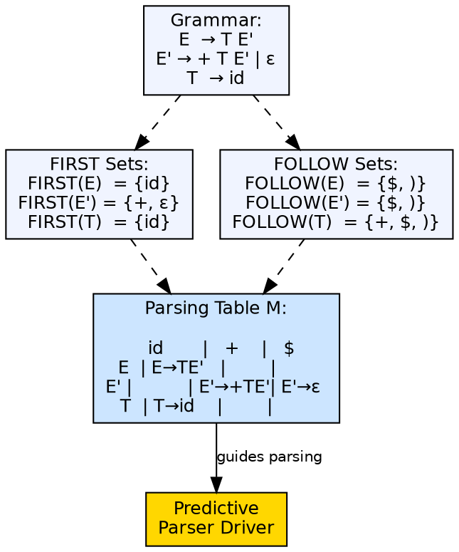
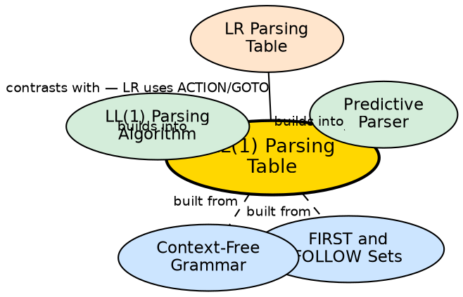

## The Problem

A predictive parser needs a decision mechanism: given a non-terminal on the stack and the current input token, which production should it apply? Manually encoding these decisions for each non-terminal is tedious. An automated construction method from FIRST and FOLLOW sets produces a compact table that drives the parser.

## Core Idea

The LL(1) parsing table is a two-dimensional array where rows are non-terminals and columns are terminals (plus `$`). Each entry `M[A, a]` contains the production `A → α` to apply when non-terminal `A` is on top of the stack and the current input token is `a`. The table is constructed algorithmically: for each production `A → α`, add the production to `M[A, t]` for every terminal `t` in `FIRST(α)`, and if `α` derives ε, add it for every `t` in `FOLLOW(A)`.

## How It Works

The construction algorithm: (1) For each production `A → α`, for each terminal `t in FIRST(α)`, add `A → α` to `M[A, t]`. (2) If `ε in FIRST(α)`, then for each terminal `t in FOLLOW(A)` (including `$`), add `A → α` to `M[A, t]`. (3) If the grammar is LL(1), every table entry will have at most one production. Multiple entries indicate the grammar is not LL(1).

## Visual Explanation

## Semantic Network

## Key Properties

- **M[A, a] format:** Row = non-terminal, column = terminal (including `$`)
- **Algorithmic construction:** Built from FIRST and FOLLOW sets, not manually
- **One entry per cell:** For an LL(1) grammar, each cell contains at most one production
- **ε-productions:** In the table for FOLLOW-set terminals when FIRST contains ε
- **Error cells:** Empty cells represent syntax errors — used for error detection and recovery

## Connections

- **Built from:** [[first-and-follow-sets|FIRST and FOLLOW Sets]] — the table is constructed from these sets
- **Built from:** [[context-free-grammar|Context-Free Grammar]] — grammar transformations may be needed before construction
- **Builds into:** [[predictive-parser|Predictive Parser]] — the table is the core data structure
- **Builds into:** [[ll1-parsing-algorithm|LL(1) Parsing Algorithm]] — the algorithm that interprets the table
- **Contrasts with:** [[lr-parsers|LR Parsing Tables]] — LR tables have ACTION and GOTO parts for bottom-up parsing

## Edge Cases & Gotchas

- **Multiple entries:** A cell with multiple productions means the grammar is not LL(1) — ambiguous or left-recursive
- **Left recursion:** Left-recursive grammars produce multiple entries in the table — must eliminate left recursion first
- **Left factoring:** Common prefixes produce FIRST conflicts — solved by left-factoring the grammar (e.g., `A → αβ₁ | αβ₂` becomes `A → αA', A' → β₁ | β₂`)
- **Table size:** Number of rows = count of non-terminals, columns = count of terminals — grows with grammar size