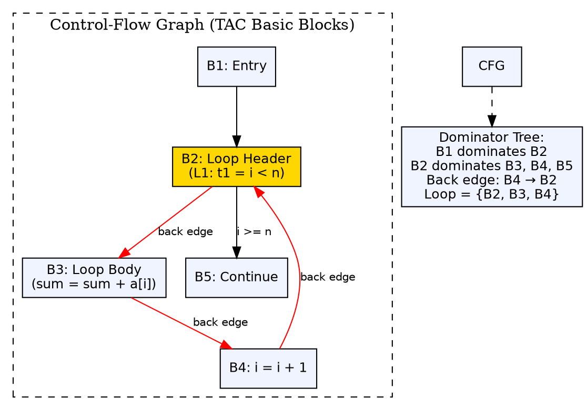

## The Problem

Loops are where programs spend most of their execution time. To optimize effectively (loop invariant code motion, induction variable elimination), the compiler must first identify which instructions belong to loops and what kind of loops they are.

## Core Idea

Loop detection in TAC identifies loop structures in the control-flow graph (CFG). A **loop** in the CFG is a set of nodes (basic blocks) where: every node can reach the loop header, and the header dominates all nodes in the loop. The key concept is **dominators** — node d dominates node n if every path from entry to n goes through d.

## How It Works

The compiler builds a control-flow graph from TAC instructions. It computes the **dominator tree** (which nodes dominate which). A **back edge** is identified when an edge from node n to node h has h dominating n. The loop consists of all nodes that can reach n without going through h. Natural loops have a single entry (the header) and are amenable to optimization.

## Visual Explanation

## Key Properties

- **Control-flow graph:** Nodes are basic blocks; edges are jumps
- **Dominator:** h dominates n if all paths from entry to n include h
- **Back edge:** Edge from n to h where h dominates n
- **Natural loop:** Header h + all nodes that can reach a back edge without passing through h
- **Nested loops:** A loop inside another — inner loop is optimized first

## Connections

- **Built from:** [[three-address-code|Three-Address Code]] — TAC provides the instruction sequence for CFG construction
- **Builds into:** [[code-optimization|Code Optimization]] — loop detection enables loop optimizations
- **Related:** [[data-flow-analysis|Data Flow Analysis]] — data-flow analysis often computes loop information
- **Related:** [[intermediate-code-generation|Intermediate Code Generation]] — TAC enables loop detection at the IR level
- **Related:** [[code-generator-design-issues|Issues in Code Generator Design]] — code generators must be aware of loop structure for register allocation

## Edge Cases & Gotchas

- **Irreducible loops:** Multiple entry points (from goto) — cannot be identified as natural loops, require special handling
- **Outer vs inner loops:** When loops are nested, the inner loop should be optimized first (maximizes benefit)
- **Infinite loops:** A loop with no exit edge — the compiler must detect this to avoid infinite optimization
- **Loop-invariant code:** Instructions inside the loop that produce the same value every iteration — should be moved to the pre-header

## Sources

- [[compilerdesign-summary|Compiler Design Tutorial]] — covers loop detection in three-address code
