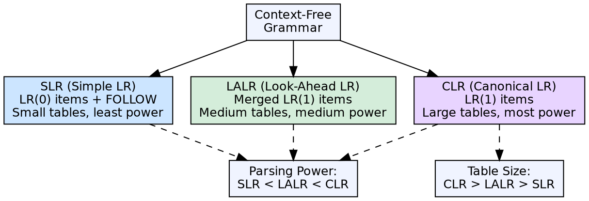

## The Problem

Simple shift-reduce parsing needs conflict resolution rules. Without lookahead information, the parser frequently faces shift/reduce or reduce/reduce conflicts. Different languages require different amounts of lookahead and different levels of parsing power.

## Core Idea

LR parsers are bottom-up shift-reduce parsers that use a deterministic finite automaton with a state stack and a parsing table. Three main variants exist: **SLR (Simple LR)** uses FOLLOW sets for conflict resolution, offering the simplest tables. **CLR (Canonical LR)** or LR(1) uses full lookahead for maximum power. **LALR (Look-Ahead LR)** merges CLR states for smaller tables while retaining most of CLR's power.

## How It Works

All three construct a set of LR items (productions with a dot position) and use them to build states. SLR uses LR(0) items and FOLLOW sets for reduce decisions. CLR uses LR(1) items with full lookahead information. LALR merges CLR states that have identical LR(0) cores but different lookaheads, producing smaller tables with fewer states but occasionally introducing reduce/reduce conflicts.

## Visual Explanation

## Key Properties

- **SLR:** Simplest, smallest tables, least powerful — uses FOLLOW sets for reduce decisions
- **CLR (LR(1)):** Most powerful, largest tables (potentially thousands of states) — uses full lookahead sets
- **LALR:** Merges CLR states with same core — table size comparable to SLR, power nearly that of CLR
- **Yacc/Bison:** Generate LALR(1) parsers — the practical sweet spot
- **LR(0):** No lookahead, least powerful — not practical for real languages

## Connections

- **Built from:** [[shift-reduce-parser|Shift Reduce Parser]] — LR parsers are shift-reduce parsers with state-based decision tables
- **Built from:** [[bottom-up-parsing|Bottom-Up Parsing]] — all LR parsers are bottom-up
- **Related:** [[first-and-follow-sets|FIRST and FOLLOW Sets]] — SLR uses FOLLOW sets for conflict resolution
- **Related:** [[compiler-construction-tools|Compiler Construction Tools]] — Yacc/Bison generate LALR parsers
- **Related:** [[syntax-analysis|Syntax Analysis]] — LR parsing is the most widely used syntax analysis method

## Edge Cases & Gotchas

- **State explosion:** CLR(1) can have thousands of states for real languages — LALR was invented to solve this
- **LALR reduce/reduce conflicts:** Merging states can introduce reduce/reduce conflicts that didn't exist in CLR — rare but possible
- **Grammar class hierarchy:** Every SLR grammar is LALR, every LALR grammar is LR(1), but not vice versa
- **Yacc uses LALR:** Most parser generators use LALR(1) — it handles nearly all programming language constructs

## Sources

- [[compilerdesign-summary|Compiler Design Tutorial]] — covers SLR, CLR, and LALR parsers in syntax analysis
- [[cd2-summary|Compiler Design for GATE Exam]] — covers LR parser family including LR(0)
